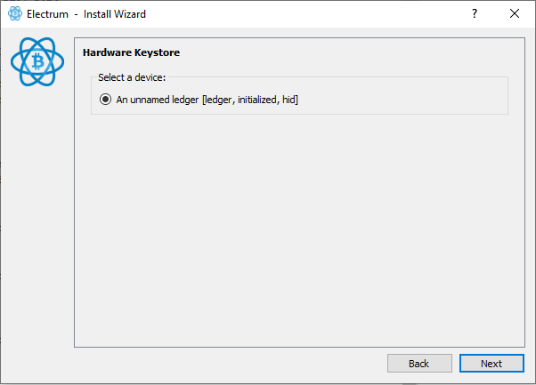
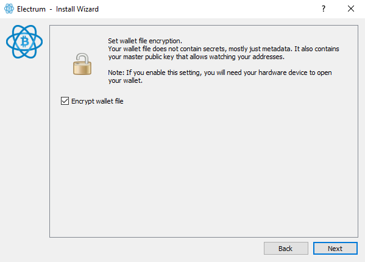

[ **Guide** ] -- [ [Bonus](https://github.com/HelgeHunding/guides/blob/master/hodl-guide/hodl-guide_60_bonus.md) ] -- [ [Troubleshooting](hodl-guide_70_troubleshooting.md) ]

---

# The Hodl Guide Ultralight

---

#### *This is a draft, all feedback is appreciated!*

This is a guide for anyone who wants to start taking control of their bitcoin holdings. Maybe you have your bitcoin on an exchange, in a web wallet or in a “hot wallet” on your computer. Or maybe you already have one or more hardware wallets but use the providers own wallet.
This is a guide for cold storage and not for a wallet used for “day to day spending”.
After you’ve completed this guide, you’ll have a foundation that you can keep building on. You can later upgrade this setup to an even more secure multi-sig with [Hodl Guide Light, Multi Sig](https://github.com/HelgeHunding/guides/blob/master/hodl-guide-light-ms/README.md) or go all the way with the more complex [Hodl Guide](https://github.com/HelgeHunding/guides/blob/master/hodl-guide/README.md).

As always with Bitcoin, I or no one else can be responsible for your bitcoin. You have to trust and hold yourself responsible for everything.


## Requirements

* One hardware wallet (Ledger, Trezor,Coldcard etc).
* One internet connected computer.
* Paper of good quality to write your secret seed on (usually included with the hardware wallet).

The guide will use one hardware wallet. I have experience with Trezor One and Ledger Nano S, so the guide will follow the procedure on those wallets. But you can of course use another hardware wallet if you like it and trust the manufacturer. You can use an existing hardware wallet if you have one. We are going to create a new wallet in Electrum that won't be linked to your previous wallets. Electrum supports most popular hardware wallets on the market.

Hardware wallets are great. But their main focus is security, not privacy. We do not know what the future might bring. For example, how governments will treat bitcoin. You won't get much privacy if you use the hardware wallet "out of the box" with the manufacturers wallet. The setup in this guide will give you the possibility to improve your privacy.
Privacy isn’t black or white, it’s a scale. Your privacy can be breached in many ways and every individual leak can be combined to reduce your privacy. We’ll try to avoid some of the worst mistakes.

### Create the secret seed with your hardware wallet

(If you are following the "hodl guide light, multi sig", Simply do this on both hardware wallets).
Start by ordering a hardware wallet. As this is specialised hardware used for storing cryptocurrencies on, consider having it shipped to a UPS access point or a similar service to not reveal your real address.
Setup the hardware wallet with the manufacturer’s instructions. Make sure no cameras can see you when you write your seed down. Use the manufacturers wallet software to upgrade the firmware on the device to the latest version. If you use a Ledger Nano S, you can use an easier PIN. We are going to change that later. If you use a Trezor One, pick a strong PIN that you can remember.

You will generate a secret seed during the setup. Write that down and keep it safe during the rest of the process (don't have it lying around visibly). This seed can be used to steal all of your bitcoin stored on the wallet!

Before moving on we are going to generate a passphrase that will protect our secret seed. This will add a layer of extra security. 

*Note:* If you lose your passphrase you risk losing your funds. 

I would recommend a passphrase generated by a password manager, containing a-z, A-Z and 0-9 and with at least 15 characters lenght. If it's a truly random passphrase, it would, on average, take hundreds of years for even the strongest computer to crack it.

You can generate and store the passphrase in a password manager like LastPass https://www.lastpass.com/. Or if you don't want to use a third party server, a great open source alternative is Keepass https://keepass.info/ where you store everything yourself. 

Warning, never put anything else from your seed into a manager like this!

So go ahead and generate a passphrase and store it in a password manager (or a secure note on your computer). We do not want to keep important information like this only in digital form. So write the password on a piece of paper as well (different paper then your seed).

If you use a Trezor one, you can go ahead with the guide. If you use a Ledger nano, you'll have to put the passphrase into the device itself. 

Do this by connecting your Ledger and enter the PIN. Go to the "desktop" and navigate to "Settings". In settings, go to "Security". At the bottom, you should see "Passphrase", select that. Select "Attach to PIN". This way you'll have two PIN-codes. One normal and one "secret". Pick a new PIN and follow the directions on the screen and enter your passphrase when asked (be extra careful when entering the passphrase). You now have two PINs. One that you can use when connecting to Ledger manager for updates or more day to day spending and one for your cold storage.

### Download and install Electrum

We are not going to use the manufacturers wallet to store our bitcoin. We are using the much more flexible Electrum Wallet. It will give you more options to increase your privacy and you won't send all your addresses to the manufacturers wallet servers.
Electrum is a wallet that has been around for many years. It offers great usability (support for multi-sig, hardware wallets etc) and you can connect it to your Bitcoin Core full node. 

Go to https://electrum.org/#download and download the installer for your operating system. We are going to verify the download with the detached signature as well (the link is next to the installer). So, download that as well.

We need the signing key of Electrum developer Thomas Voegtlin to verify the signatures. Scroll down to the bottom of the page and click on the “Public Key” link (you can skip this on Linux and use gpg --import ThomasV.asc):


That should take you to a page with the public key, use `Ctrl+S` and save the file `ThomasV.asc` on your computer (preferably in the same location as the downloaded installer).

Once downloaded we need to verify the signatures to make sure the developers signed this release. This is an important step. This would catch a scenario where electrum.org was compromised or where you went to the wrong site to download a malicious version (100s of bitcoin has probably been lost because of this).

To verify what we downloaded, we need GnuPG (https://gnupg.org/). The implementation varies for different OS:

*Windows:* Download and install the latest version of Gpg4win https://www.gpg4win.org. If you don’t want to donate, click bank transfer on the download page to acces the download. You only need to install GnuPG and Kleopatra. Start Kleopatra once finished. 

*macOS:* Download and install the latest version of GPG Suite https://gpgtools.org/ 

*Linux:* GnuPG comes pre-installed with Linux distributions.

An easy way to verify a digital signature is to use a terminal (the command line). 
In all examples, what´s written to the terminal is everything after the `$` sign (and examples that's specific for Windows uses the symbol `>`). 

For example: `$ cd` 

Means that you´d write `cd` to the command line (cd is a command that changes the active directory). 

Usually you can paste text to a terminal with ctrl+v or with a right click on the mouse. Another useful shortcut is to use the arrows up and down to toggle between previously executed commands. If you´re stuck, you can usually kill a process with Ctrl+C or Ctrl+Z. 

To start, we need to change the active directory with `$ cd`. 

*Windows:* Open `Powershell` (search for it or use Win+R, type powershell and hit enter) 

*macOs:* Click the Searchlight (magnifying glass) icon in the menu bar and type `terminal`. Select the Terminal application from the search results. 

*Linux:* Varies, on Ubuntu, press Ctrl+Alt+T 

Change the current directory to the one where the 3 downloaded files are located, for example: 

`$ cd ~/Downloads` 

Import the signing key from ThomasV into your local GPG installation: 

`$ gpg --import ThomasV.asc` 

Verify the file you downloaded with the detached signature. For example on Windows:

`$ gpg --verify electrum-3.1.3-setup.exe.asc` 


(make sure to change the file name if using a different version). 

The output should be something like:
```
gpg: assuming signed data in 'electrum-3.3.4-setup.exe'
gpg: Signature made 02/13/19 23:08:30 W. Europe Standard Time
gpg:                using RSA key 6694D8DE7BE8EE5631BED9502BD5824B7F9470E6
gpg: Good signature from "ThomasV <thomasv1@gmx.de>" [unknown]
gpg: WARNING: This key is not certified with a trusted signature!
gpg:          There is no indication that the signature belongs to the owner.
Primary key fingerprint: 6694 D8DE 7BE8 EE56 31BE D950 2BD5 824B 7F94 70E6
```

The important parts to look for is when the signature was made `02/13/19 23:08:30`, that should be close to the date of the release. And the two most important things, that it is a `Good signature`and that the fungerprint is `6694 D8DE 7BE8 EE56 31BE D950 2BD5 824B 7F94 70E6`. This ensures that the release was signed by the developers key. To double check that this really is the fingerprint of the right key, you can search for it online and should get results from various sources.

If you have this result go ahead and install or run Electrum. 

If you are interested in a more private solution, I would recommend that you setup Electrum to run over Tor at this point (before you create your cold storage wallet). You can find a guide for that, [here](https://github.com/HelgeHunding/guides/blob/master/hodl-guide/hodl-guide_66_electrum-tor.md).

*If you are following the "Hodl guide light, multi sig", change to that guide now. You can find the guide [Here](https://github.com/HelgeHunding/guides/blob/master/hodl-guide-light-ms/README.md).

## Create the wallet

You can now create a new wallet. If you have a wallet open, go to File>New/Restore. Otherwise the installer should be launched automatically. Pick a name for the wallet and click Next:


Let Standard wallet be selected and click Next,


Change to "Use a hardware device". Insert your hardware wallet. If you use a Ledger Nanon S, unlock it with the "secret PIN" that contains your passphrase. Then click next. If using a Trezor, simply connect it and click next:


Your hardware wallet should be detected (otherwise rescan by clicking Next), click Next: 



If you use a Trezor, enter the PIN and the passphrase when asked for it.

You can let "Native Segwit" be selected. This is a newer type of address that'll give you lower fees. If you use an old hardware wallet, this will ensure that you create a new wallet not linked to your previous account. You can always create more wallets by increasing the last number. For example, if you'd like to create a new wallet at a later date, change to `m/84'/0'/1'`. But for now keep it at `m/84'/0'/0'`(unless you have an old wallet with this path and the same passphrase). Click Next.


Your wallet is now being created. Let "Encrypt Wallet" be selected. This will ensure that the wallet can't be opened unless you have your hardware wallet connected. This will reduce the risk that your wallet balance will be exposed. You can still recover your funds with the secret seed + the passphrase if you lose your hardware wallet. Go ahead and click Next:



Your wallet is now created you should see the following:


## Store secret information

You now have to decide how to store everything. 

You should have the following:

* One hardware wallet (containing your secret seed, accessed with a PIN-code).
* One Passphrase in a password manager or a secure note.
* A note with your secret 24 word seed.
* A note with your passphrase on it.

Storing this in a secure way is harder then if you use a multi-signature setup. It all depends on your situation and threat level. You shouldn't store the passphrase and the seed togheter. Those two combined can be used to steal your funds. 

So, how you store your funds is a balancing act between accessability and secirity. I guess you want to be able to access your funds in case your house burns down. Do you also want your relatives to be able to access the funds in case you are in a coma and needs to pay your hospital bills?

A base case for storage could be this:
* Make sure that you can access your password manager from another place then your home. In that case, you should always have access to your passphrase. That could be by making a copy of your secure note to an USB-flash drive (make sure the note is encrypted) and storing it elsewhere or by using LastPass servers.
* Store your secret seed with someone you trust (or in a bank vault/deposit box that trusted persons gets access to incase of an emergency). This person won't be able to steal your bitcoin or even know what how much you own unless they gets access to your passphrase. That only holds true if the passphrase is secure enough, 15 random characters should be enough (so, it can't be brute forced).
* Store your hardware wallet at home. Use this to access your funds.
* The note with the passphrase is what makes this setup flexible. How you store it depends on how much you trust other people.
  * Option 1: Store it with a second trusted person. In this case, person 1 and 2 can collaborate to access your funds in case of an emergency. But, they can as well collaborate to steal your funds. This will probably be more secure if you change one of the persons to a bank vault or deposit box.
  * Option 2: Store it at home. You can still access your funds if your house burns down by using the backup seed and the passphrase stored in your secure note. But it's harder for your relatives to access your funds in case of an emergency. They would have to find the note with your passphrase in your home and figure out that it belongs to the secret seed.
  
I hope that gives you some guidelines!

## Improve your storage


---
Get started: [Preparations >>](hodl-guide_10_preparations.md)


