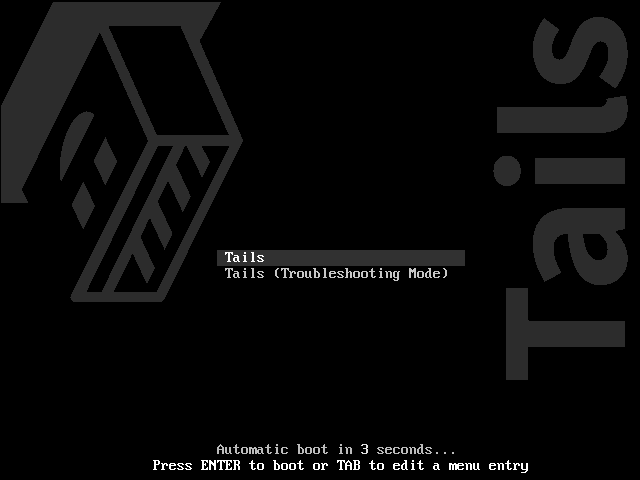

[ [Intro](README.md) ] -- [ [Preparations](raspibolt_10_preparations.md) ] -- [ **The First Keys** ] -- [ [Lightning](raspibolt_40_lnd.md) ] -- [ [Mainnet](raspibolt_50_mainnet.md) ] -- [ [Bonus](raspibolt_60_bonus.md) ] -- [ [Troubleshooting](raspibolt_70_troubleshooting.md) ]

---

# Generate the last key with Tails

We are generating the last key with Electrum on a computer booted with Tails, https://tails.boum.org/. Tails is a live operating system that´s built upon Debian (a Unix-like operating system). 
It´s booted from a USB-stick and only uses the computers RAM-memory which means that all sensitive information is erased when the USB is ejected (and your computer will start with your usual operating system like nothing happened). 

### Install Tails
Go to https://tails.boum.org/install/index.en.html and choose your operating system. If you don´t have an old copy of Tails, select “Install from {Your operating system}”. 
Select “Let´s go” and download the USB image at step 1.1 to a directory on your computer. At the download page, make sure to download `tails-signing.key` and `tails-amd64-3.12.1.img.sig` (at the “OpenPGP signature for the Tails 3.12.1 USB image” link, the exact name should change for future versions) and place the files in the same directory as the .img file. 
Wait until the USB image is downloaded.

We need to verify what we have downloaded (and that´s why we downloaded the last two files). As we are verifying the download ourselves, skip step 1.2 “Verify your download using your browser”. The browser extension is probably fine, but it´s a great practice to do it yourself as the process can be used for other downloads as well. And browser extensions always comes with a risk of leaking personal information, so always be cautious with browser extensions (no idea if this particular extension does that, probably not). 

It’s the same procedure as before (check the [Preparations](raspibolt_10_preparations.md) for more information about validating signatures). 

Change the current directory to the one where the 3 downloaded files are located: 
`$ cd $HOME/Downloads`

To be able to verify the signature, import the Tails-signing key into your local GPG installation: 

`$ gpg --import tails-signing.key`

Now use the “detached signature” to check that the .img file was signed with the signing key we imported:

`$ gpg --verify tails-amd64-3.12.1.img.sig tails-amd64-3.12.1.img` (make sure to change the file name on both places if using a newer version). The verification can take a while. 

Expected output should be something like:
```
gpg: Signature made 01/28/19 18:44:16 W. Europe Standard Time 
gpg: using RSA key FE029CB4AAD4788E1D7828E8A8B0F4E45B1B50E2 
gpg: Good signature from "Tails developers (offline long-term identity key) <tails@boum.org>" [unknown] 
gpg: aka "Tails developers <tails@boum.org>" [unknown] 
gpg: WARNING: This key is not certified with a trusted signature! 
gpg: There is no indication that the signature belongs to the owner. 
Primary key fingerprint: A490 D0F4 D311 A415 3E2B B7CA DBB8 02B2 58AC D84F 
Subkey fingerprint: FE02 9CB4 AAD4 788E 1D78 28E8 A8B0 F4E4 5B1B 50E2 
```
The important part is the date, `Good signature` and Primary key fingerprint `A490 D0F4 D311 A415 3E2B B7CA DBB8 02B2 58AC D84F` 
This ensures that the .img file was signed with a key with the fingerprint A490 D0F4… at a date, not to long before the release. If we do an online search, one of the first matches was [@Tails_live](https://twitter.com/tails_live) on what seems to be a legit Twitter account and who has the fingerprint in the bio. 

Another match is a post from 2015 on the official webpage that announces a change to this key and we can also see several old posts from Reddit. We can be almost certain (not possible to do more) that this release was indeed signed by the developers. This process would catch a scenario were a malicious actor had taken control over the webpage and uploaded a bad file and a bad signing key. If you get a bad signature or another fingerpringt, stop and investigate further before installing anything. 

If everything is good, go ahead and create the boot usb. This is going to be used to create the last private key.  

The easiest way is to follow the instructions on https://tails.boum.org/install for your operating system. 

So, insert the USB you are going to use in your computer and follow the instructions at “2/5 Install Tails”. In Mars 2019 that means downloading, running and flashing the USB with Etcher for Windows and macOS and with GNOME Disks for Linux. When step 2/5 is completed, you´ve got two choices. 

If you use one computer. Tails is going to be started on the computer you are reading this on. In that case you´re going to have to print or write down the rest of the of the instructions on this page. You could also bring the instructions up on another device (keep them in flight mode and don’t let any cameras see any screens or private keys). Make sure no other USB drives is connected to the computer.

If you are using two computers. Tails is going to be started on the other computer and you can keep the instructions on the main computer. The other computer could be a normal computer that's going to be used for other things after the process. Or for extra security, an eternally quarantined computer. Make sure no other USB drives is connected to the computer.

Go ahead and make sure that the USB with Tails is inserted in the right computer. Start (or restart) the computer.

If the computer starts on Tails, the ”Boot Loader Menu” should appear:


---
Next up: [Generate the last key with Tails >>](hodl-guide_30_last-key.md)


