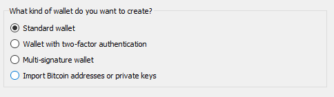
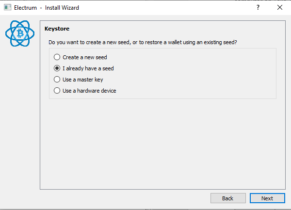

[ [Intro](README.md) ] -- [ [Preparations]( hodl-guide_10_preparations.md) ] -- [ [First Seeds](hodl-guide_20_first-seeds.md) ] -- [ [Last Seed](hodl-guide_30_last-seed.md) ] -- [ **Multi-Sig** ] -- [ [Storage](hodl-guide_50_storage.md
) ] -- [ [Bonus](hodl-guide_60_bonus.md) ] -- [ [Troubleshooting](hodl-guide_70_troubleshooting.md) ]

---

# Create a multi-sig wallet with Electrum

You should now have the following information:
* `Seed A`
* `Information package A` containing `PIN_A: pin_hw_a`
* `Seed B`
* `Information package B` containing `PWA: your_password_A` and `PIN_B: pin_hw_b`
* `Seed C`
* `Information package C` containing `PWB: your_password_B`
* `Hardware Wallet A` (containing seed A)  
* `Hardware Wallet B` (containing Seed B)
* `Secure note` containing: 
```
PWA: your_password_A
PWB: your_password_B
```

You need to have this at hand to finish the process:
* A computer connected to the internet (can be your normal computer).
* 1 phone with a camera or a digital camera (don't bring this near the computer until your seed is generated).
* 1 USB flash drive with Tails flashed to it (USB1).
' 1 USB flash drive with the Electrum appimage (USB2).
* *Optional:* A second computer that you run Tails on. 
* `Seed C`
* `Hardware Wallet A` (containing seed A)  
* `Hardware Wallet B` (containing Seed B)
* `Information package A, B and C`

We are using Electrum on our main computer to construct the multi-signature wallet.


## Download and verify Electrum

As we've alreade verified all signatures, go ahead and run or install Electrum. When you start Electrum you should be asked to create a new wallet (or load a default one if this isn't the first time). Before creating our multi-sig wallet, you should consider configuring Electrum to run over Tor.

### [P] Setup Electrum to run over Tor

Electrum use servers that’s run by volunteers to validate and broadcast transactions. Anyone can start a server and if you don’t specify a server, you’ll be connected to one randomly. This is terrible for privacy (and has been used for phishing attacks). If you don’t use Tor or a VPN you’re essentially giving a random server your IP-address and all your bitcoin addresses.

There's several companies that specialises in chain analysis to deanonymize addresses and we can assume that they’re running several Electrum Servers. If you bought your bitcoin on an exchange that use KYC (know your customer), you can assume that your private data will be leaked sooner or later. If you don't do something about it, risk is that almost every transaction you do can be linked to you. A first good step is to use Tor. It uses "onion routing" to hide your real IP-address. You can also use a VPN, both solutions will hide your real IP-address from random servers. With a VPN, you'll trust the provider (all traffic goes through them) which is probably safe as long as Bitcoin is legal in your jurisdiction (but you never know).

Using Electrum with Tor should be a fairly straightforward process and we might as well do it from the start. If you don't have Tor, go to https://www.torproject.org/projects/torbrowser.html and download the latest version of Tor Browser for your OS. You should now know how to verify digital signatures. So, download the signature (.asc) for the file you download as well. You can import the Tor signing key with the command:

`gpg --keyserver pool.sks-keyservers.net --recv-keys 0x4E2C6E8793298290`

Then use:

`gpg --verify {your_file.asc}`

Make sure the output is similar to this:
```
gpg: assuming signed data in 'torbrowser-install-win64-8.0.6_en-US.exe'
gpg: Signature made 02/12/19 14:26:17 W. Europe Standard Time
gpg:                using RSA key EB774491D9FF06E2
gpg: Good signature from "Tor Browser Developers (signing key) <torbrowser@torproject.org>" [unknown]
gpg: WARNING: This key is not certified with a trusted signature!
gpg:          There is no indication that the signature belongs to the owner.
Primary key fingerprint: EF6E 286D DA85 EA2A 4BA7  DE68 4E2C 6E87 9329 8290
     Subkey fingerprint: 1107 75B5 D101 FB36 BC6C  911B EB77 4491 D9FF 06E2
```

When Tor is installed, start Tor. That could be done in two ways. You can launch the browser (it’s much easier to use then a few years ago) or only start Tor (like tor.exe on WIndows). Only Tor should be located at `.\Tor Browser\Browser\TorBrowser\Tor`. You won't notice anything if you launch Tor without the browser (nothing visible will start).

Start Electrum. To access the settings in Electrum, you need to open a wallet. 

If this is the first-time using Electrum, you'll have to create a wallet (skip these steps and open a wallet if you already have one). The wallet you create can be a "dummy" wallet that you delete after the process. We only use this wallet to access the settings so you don't connect to random servers with your real IP-address (and give them all your addresses) once your cold storage multi-sig wallet is created.

Pick a name for the wallet, click Next:


Let Standard Wallet be selected, click Next:


Change to "Use a master key" and click Next:


Since we only want a dummy wallet to access the settings, paste this key in the field and click Next: `xpub661MyMwAqRbcF7NVwdGV5gKTj5cqEwDcJv21g1RqF51YmWj5ycNE4S8Vv3dFZRufGJvbfoFM2hapK6Sd7fdXtyF9QrpKBStMX5LAYJVNWoC`


We don't need a password for this wallet, leave the field blank and click Next:


Electrum should now start. Go to `Tools>Network`. Change the tab to `Proxy`. Select "Use Proxy" and make sure `SOCKS5` is `127.0.0.1` and that the port is `9050`:


Close the network dialog. The circle in the bottom right corner should now be blue and not green. You have now configured Electrum to run over Tor. Electrum won’t connect to anyone unless Tor is running (even if you restart it). 

*Troubleshooting:* If you aren't getting a blue circle or any connections try changing the port to `9150`. Tor can sometimes use this port on Windows.

## Create the multi-sig wallet

We are now going to create our multi-sig wallet. If you already have a Electrum Wallet open, go to `File>New/Restore` (or use Ctrl+N). Otherwise start Electrum, the install wizard should be launched automatically. 

Pick a name for your multi-sig wallet and click Next:


Select "Multi-signature wallet" and click Next:


Change the first slider to 3 cosigners (with 2 signatures required) and click Next:


We are now going to construct our multi-sig. Start with `Hardware Wallet A`, that's going to be cosigner A. If you use a wallet, like Ledger, where the password is written on the device. Make sure the password is active before moving on. Select `Use a hardware device` and click Next:


Electrum should detect your hardware wallet and show its name. If detected, click Next (otherwise, rescan by clicking Next). If using a hardware wallet where the pin and password is entered on the computer (like Trezor), enter the pin and `password A` after you've clicked Next:


You should then be asked what type of address you'd like to use. You can let native segwit multisig (p2wsh) be selected. It'll give you the lowest transaction fees:


*Note:* Some services are slow to update and can't send directly to native segwit addresses. Most should update soon and you can always use an intermediate wallet (like a normal Electrum wallet) if you can't send directly.

The next window shows your Master Public Key, we will access this later in Electrum and can skip it now. Click Next:


We are now going to add cosigner 2. Remove Hardware Wallet A and insert Hardware Wallet B and repeat the process you used for cosigner 1. If it’s a wallet with a physical pin like Ledger, enter the pin (and make sure that it uses `password B`). Select `Cosign with hardware device` and click Next. 

.

Electrum should detect your hardware wallet and show its name. If detected, click Next (otherwise, rescan by clicking Next). If using a hardware wallet where the pin and password is entered on the computer (like Trezor), enter the pin and password B after you've clicked Next: 


The next window should be where you add cosigner 3 of 3. We are now going to use the seed we created with Tails. Select “Enter cosigner key” and click next:


Click the QR-code in the bottom right corner and scan the QR-code on your phone:


That should bring up your `xpub...` key

If you have an error with scanning the QR-code, check the Troubleshooting guide [Scan QR-code with Electrum](hodl-guide_71_scan-QR.md)
  
When the QR-code is in the field, click Next:


Your wallet is now created and you should be asked for a password to encrypt your wallet. This is for your master public keys that’s stored on your computer and it’s a good idea to protect that with a password. Pick a strong password, preferably generated by a password-manager. You will need this password to open the wallet in Electrum (but not for restoring your funds, you can always restore your funds with your seeds + the seed passwords). You can store this password in LastPass, KeepassX or similar managers or use a password you'll remember. Enter the password, confirm it and click Next: 


You should now see the following:


Congratulations, your wallet is created! 

If you disconnected one, or both, of your Hardware Wallets. You'll probably get a message like this:


You can simply click `No`

If you use Electrum over Tor (the circle in the bottom right corner should be blue), you have a pretty solid setup and can use this as it is. Electrum won’t connect unless you use Tor and you will hide your real IP-address from any servers. But you still rely on third parties for validation and broadcasting. It's fine for our test deposit and we can improve this later. 

We are going to deposit a small amount of bitcoin to one of our addresses to make sure everything works. In the beginning of 2019, transactions are practically free. So, a few $ worth of bitcoin is plenty to try it out. The amount should cover 3 transaction fees. 

*Note:* Always think twice before depositing funds to your cold storage. I highly recommend to properly mix any coins deposited to cold storage (especially if they are from an exchange with KYC). This is only a test deposit to a one-time address, so mixing is not that important here. You can deposit from any normal wallet and can think about mixing later.


## Deposit Program

This can be used every time you want to deposit funds to your cold storage.

Open your multi-sig wallet in Electrum and enter the password that unlocks the wallet. Go to Receive and copy the “Receiving address”. 

*Note:* If you used Zbar to scan your QR-code, there might be a problem with copy and pasting. A restart of Electrum should fix that.

Go to another wallet (like Wasabi Wallet or another Electrum wallet) and send your bitcoin to the receiving address. You should see the unconfirmed balance almost immediately. 

*Optional:* If you want to know that your backup works, you might want to go through the trouble of doing a full restore of your wallet. Do this by opening your wallet in Electrum, go to File>Delete (or Ctrl+O) to delete your wallet file. Close the wallet you deleted in Electrum. Go back to the first step of [create the multi sig wallet](https://github.com/HelgeHunding/guides/blob/master/hodl-guide/hodl-guide_40_multi-sig.md#create-the-multi-sig-wallet) and set it up exactly the same way as you did before (same password etc). But this time use another source of information. If you used your secure note for the passwords the first time, use the information in the information packages this time. When the wallet is recovered, your funds should be there and you can be sure that your process works. 


## Withdrawal program

This can be used when you want to withdraw funds from your cold storage. 

**[P]** If you don't know about coin control and have 100% control of your unspent outputs. Never use funds in your cold storage for day to day spending and don't transfer funds from your cold storage directly to someone that knows your real name or address (like a friend or an exchange). If you connect your real name and/or physical address with addresses in your cold storage, that could be used to "cluster" addresses together and reveal what addresses you control. A good rule of thumb is to use Wasabi Wallet, or a similar service, to mix all funds going into cold storage and all funds going out of cold storage. Or learn about simple coin control. The most improtant thing is to not mix different outputs with each other unless you know it won't hurt your privacy. *Note:* Some exchanges might treat bitcoins involved in coin join transactions as suspicious and deny your deposit. You have to decide yourself between privacy and ease of selling.

If this is the firs time withdrawing from the wallet, we’re going to do two test withdrawals (and we don't have to think about mixing). The first one with your two hardware wallets. The second one is with your third backup seed and one hardware wallet. That procedure is only necessary if you lose one seed or its password and the corresponding hardware wallet. Normally, use the method described in "Withdrawal method 1". 

#### Withdrawal method 1

Open your wallet in Electrum. Connect your 2 hardware wallets. You can connect both at the same time or one at a time. If you use them one at a time, start with Hardware Wallet A. On the Send tab, create an ordinary transaction with half of your test amount to an address you control (like an address in Wasabi Wallet or in another Electrum Wallet). Once the transaction is constructed click `Send`:


Sign and confirm the transaction with one Hardware Wallet at the time, start with Hardware Wallet A. If your hardware wallet has a screen, control the information (like address and amount) on the screen.

Once confirmed, your transaction should be broadcasted!


#### Withdrawal method 2

This is the backup method and should only be needed in case you lose one hardware wallet and its seed. It makes sure that our third seed works. 

In Electrum, go to send, enter an address to another wallet you control. 
Select the rest of the test amount you have left in the wallet, pick a fee and select “preview”:


In the preview window, select the QR-code in the bottom left corner:


That should bring up the QR-code. Take a photo of the QR-code with your phone. You can close the Transaction dialog.

We are now going back to Tails. So, either go to your second computer or restart your main computer on Tails. We are going to handle a seeds, make sure to follow the same procedure that you used when generating the seeds (that no one can see what you do). In Tails, launch Electrum like before. If you already have Electrum running create a new wallet by going to `File>New/Restore` (we are going to create the exact same wallet as before to check that our seed works).

Click next at the first window:


We only need the signature, so keep “standard wallet” selected and click Next:



Select “I already have a seed” and click Next:



Enter your 12-word seed on the next screen (again, this is valuable information):


Leave the password field empty (the wallet file will be deleted once finished):


The wallet should now load. Go to `Tools>Load Transaction>From QR code`
Scan the QR code on your phone. 

This should bring up the same Transaction Window that you had on your main OS. If you get an error, check that the Electrum version is the same in Tails as on your main computer.

Start by first clicking “Sign”. That should Sign the transaction.
Then click the QR-code:


Take a photo of the QR-code with your phone. 

You can now close Electrum and Tails (we won’t be using it anymore). Remove both USB flash drives from the computer to close Tails and delete all sensitive information.

Go back to your main computer and open your multi-sig wallet in Electrum. Go to `Tools>Load Transaction>From QR code` and scan the last QR-code. You might have to start Zbar and select a camera for the camera to work (and it might be slow to start, so try 2-3 times). 

*Note*, if you are using another way to scan the QR-codes. Scan the QR-code outside of Electrum. In Electrum, go to `Tools>Load Transaction` and paste the text.

That should bring up the transaction window.

Connect one of your hardware wallets and click sign. Follow the instructions on your Hardware Wallet, control the address and the amount, and sign the transaction. 

If you are using Hardware Wallet B to sign, you’ll probably get a message like this:


Select `No` and wait for Electrum to detect Hardware Wallet B. Once detected, click `Sign` and follow the instructions on your Hardware Wallet (this process can be rather slow). Once signed, wait for Electrum to calculate everything. 

Once calculated, click `Broadcast`:


Your transaction should be broadcasted to the network!

## Update information packages

Before moving on, we need to fill in the last information in the information packages. 

With your wallet open in Electrum, go to `Wallet>Information`. 

In your `secure note` add all master public keys, like this:
```
MPK1: xpub668...
MPK2: xpub78e...
MPK3: xpub87t...
```
In `information package A` add the master public key from cosigner 3 This is like backup for the backup but should still be treated with care. It's easy to miss one character if typing it by hand. Consider printing it on a printer, if you own one, and attaching it to the note. Otherwise double check what you print:

`MPK3: xpub668...`

In `information package C` add the master public key from cosigner 2:

`MPK2: xpub78e...`

That’s it! Finish by deleting all the pictures of QR-codes on your phone or camera.

---

Next up: [Storage >>](hodl-guide_50_storage.md)
