[ [Intro](README.md) ] -- [ [Preparations]( hodl-guide_10_preparations.md) ] -- [ [First Seeds](hodl-guide_20_first-seeds.md) ] -- [ [Last Seed](hodl-guide_30_last-seed.md) ] -- [ **Multi-Sig** ] -- [ [Storage](hodl-guide_50_storage.md
) ] -- [ [Bonus](hodl-guide_60_bonus.md) ] -- [ [Troubleshooting](hodl-guide_70_troubleshooting.md) ]

---

# Create a multi-sig wallet with Electrum

You should now have the following information:

* `Seed A`
* `Information package A` containing `PIN_A: pin_hw_a`
* `Seed B`
* `Information package B` containing `PFA: your_passphrase_A` and `PIN_B: pin_hw_b`
* `Seed C`
* `Information package C` containing `PFB: your_passphrase_B`
* `Hardware Wallet A` (containing seed A)  
* `Hardware Wallet B` (containing Seed B)
* `Digital note` containing:

```
PFA: your_passphrase_A
PFB: your_passphrase_B
```

You need to have this at hand to finish the process:

* A computer connected to the internet (can be your normal computer).
* 1 phone with a camera or a digital camera.
* 1 USB flash drive with Tails flashed to it (USB1).
' 1 USB flash drive with the Electrum appimage (USB2).
* *Optional:* A second computer that you run Tails on.
* `Seed C`
* `Hardware Wallet A` (containing seed A)  
* `Hardware Wallet B` (containing Seed B)
* `Information package A, B and C`

We are using Electrum on our main computer to construct the multi-signature wallet.

## Create the multi-sig wallet

As we've already verified all signatures, go ahead and run or install Electrum on your main computer/OS by using the file you downloaded earlier. When starting Electrum, you should be asked to create a new wallet (or load one if this isn't the first time using Electrum).

### [P] Using Electrum over Tor or with your own server

I know that leaving the guide isn't optimal at this point. But, if you are trying to keep your cold storage as private as possible you need to setup Electrum the right way before creating your main wallet. Otherwise information about your wallet will be sent to third party servers and you can never undo that. The minimum step is setting up Electrum to run over Tor. This will hide your real IP-address from any server. You can follow [the guide in the bonus section](/hodl-guide/hodl-guide_66_electrum-tor.md).

Even if you use Electrum over Tor, your addresses will still be clustered together (not visible on the blockchain, but for someone running a server you connect to). The only real solution to this is using Electrum with your own Bitcoin full node.

This can be a little bit tricky for a non-technical user (especially on Windows and Mac). If you have a full node up and running, there's guides for connecting it to Electrum on [Windows](hodl-guide_63_eps-win.md) and [Mac](hodl-guide_64_eps-mac.md) in the bonus section. Linux user can watch a tutorial [Here](https://www.youtube.com/watch?v=1JMP4NZCC5g) (not my tutorial) or follow the official documentation. You can read more about the project on https://github.com/chris-belcher/electrum-personal-server. As your multi sig wallet isn't created yet, you'll have to use another wallet for the server at first. You can use the "dummy" wallet in the Tor-guide if you don't have an existing wallet.

Once done you can use Electrum as usual, but without relying on someone else for verifying and broadcasting transactions. No one else will know what addresses you are interested in. You can use it for more “day-to-day” spending as well. You can connect a single hardware wallet to Electrum or use a hot-wallet (seed stored on the computer) and verify all transactions yourself.

### Creating your multi sig wallet

If you already have an Electrum Wallet open, go to `File>New/Restore` (or use Ctrl+N). Otherwise start Electrum, the install wizard should be launched automatically.

Pick a name for your multi-sig wallet and click Next:


Select "Multi-signature wallet" and click Next:

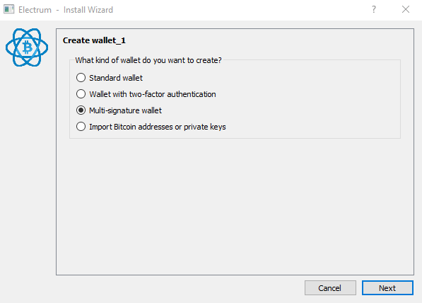

Change the first slider to 3 cosigners (with 2 signatures required) and click Next:


We are now going to construct our multi-sig. Start with `Hardware Wallet A`. If you use a wallet, like Ledger, where the passphrase is entered into the device. Make sure the right passphrase is active before moving on (you don't have to worry about this with Trezor).

For Ledger Nano S, the procedure is the following:

Connect your Ledger and enter the PIN. Go to the "desktop" and navigate to "Settings". In settings, go to "Security". At the bottom, you should see "Passphrase", select that. You now have two choices.

The first option is "Set temporary". If you select that, you'll have to enter your passphrase into the wallet every time you use it (but can use your regular PIN).

The second option is "Attach to PIN". This way you'll have two PIN-codes. One normal and one "secret". If you select this, pick a new PIN and follow the directions on the screen and enter your passphrase when asked (be extra careful when entering the passphrase). You now have two PINs. One regular and one "secret". If you use this, you have to change the PIN in the corresponding information package as well (or first change the PIN on the Ledger and then use your first PIN as the "secret" PIN). Disconnect and reconnect the Ledger and use the "secret" PIN to unlock the device.

Make sure that the "Bitcoin app" is open on the Ledger device.

If you want more information check out [Ledgers guide](https://support.ledger.com/hc/en-us/articles/115005214529-Advanced-passphrase-security).

Once the wallet is connected, select `Use a hardware device` and click Next:

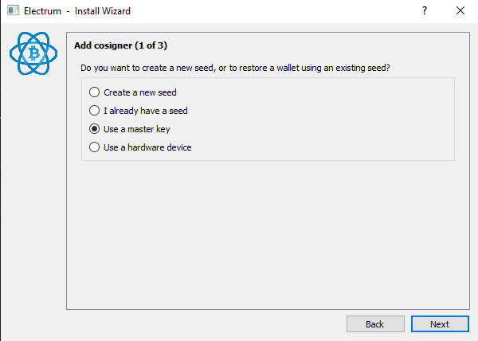

Electrum should detect your hardware wallet and show its name. If detected, click Next (otherwise, rescan by clicking Next). If using a hardware wallet where the pin and passphrase is entered on the computer (like Trezor), enter the pin and `passphrase A` after you've clicked Next:


You should then be asked what type of address you'd like to use. You can let native segwit multisig (p2wsh) be selected. It'll give you the lowest transaction fees and more security. So, click Next:

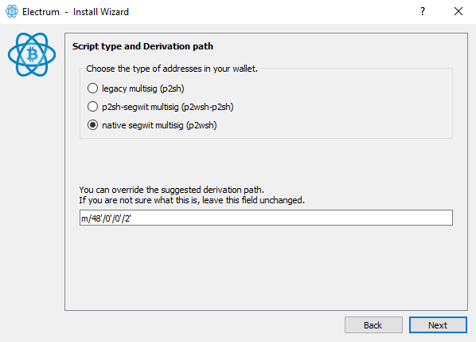

*Note:* Some services are slow to update and can't send directly to native segwit addresses. Most should update soon and you can always use an intermediate wallet that can send to native segwit (like a normal Electrum wallet) if you can't send directly.

The next window shows your Master Public Key, we don't have any other cosigners to share it with and don't need it now. So, click Next:


We are now going to add cosigner 2. Connect Hardware Wallet B and repeat the process you used for cosigner 1 (you can let Hardware wallet A be connected, just make sure to select the right wallet at next step). If it’s a wallet with a physical pin and where the passphrase is entered on the device, like Ledger, enter the pin and follow the instructions for Ledger at cosigner 1 (make sure to use `passphrase B`).

When connected, select `Cosign with hardware device` and click Next:

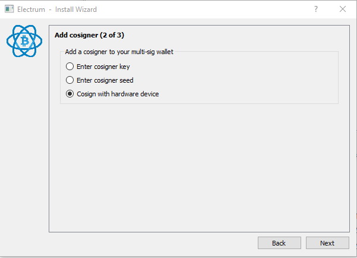.

Electrum should detect your hardware wallet and show its name. If detected, click Next (otherwise, rescan by clicking Next). If using a hardware wallet where the pin and passphrase is entered on the computer (like Trezor), enter the pin and passphrase B after you've clicked Next:

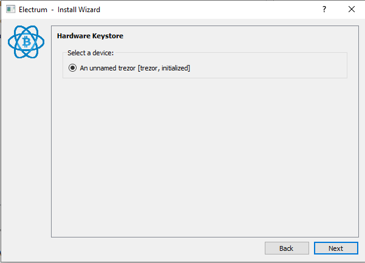

You should be asked for address type. Let native Segwit be selected and click next:


The next window should be where you add cosigner 3 of 3. We are now going to use the seed we created with Tails. Select “Enter cosigner key” and click next:

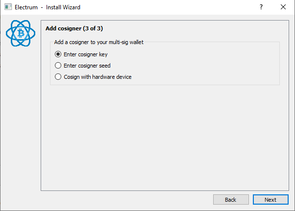

Click the QR-code in the bottom right corner and scan the QR-code on your phone:

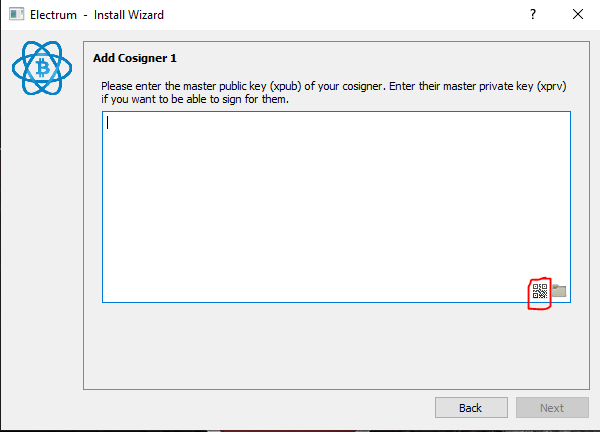

That should bring up your `Zpub...` key.

If you have trouble with scanning the QR-code, check the Troubleshooting guide [Scan QR-code with Electrum](hodl-guide_71_scan-QR.md)
  
When the QR-code is in the field, click Next:

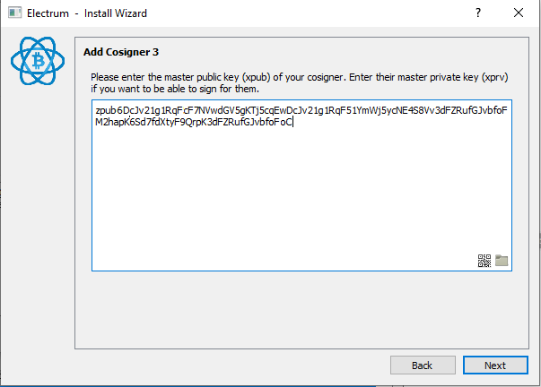

Your wallet is now created and you should be asked for a password to encrypt the wallet. This is for your master public keys that’s stored on your computer (and not for your secret seeds). It’s still a good idea to protect those with a password as they can be used to derive all addresses in your wallet. Pick a strong password, preferably generated by a password-manager. You will need this password to open the wallet in Electrum (but not for restoring your funds, you can always restore your funds with your seeds + the seed passphrases). You can store this password in LastPass, KeepassX or similar managers or use a password you'll remember. Enter the password, confirm it and click Next:

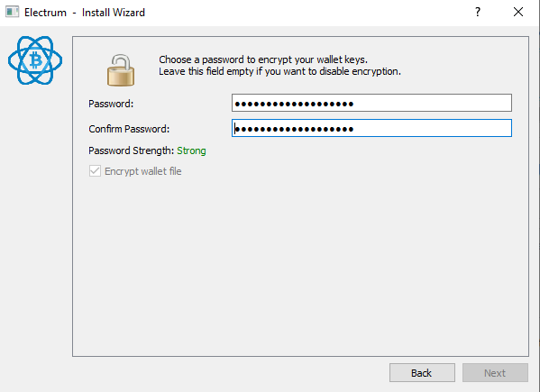

You should now see the following:


Congratulations, your wallet is created!

If you disconnected one, or both, of your Hardware Wallets. You'll probably get a message like this:

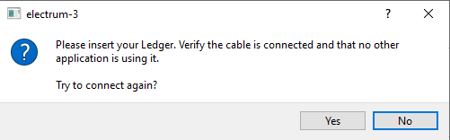

You can simply click `No`

We are going to deposit a small amount of bitcoin to one of our addresses to make sure everything works. In the beginning of 2019, transactions are practically free. So, a few $ worth of bitcoin is plenty to try it out. The amount should cover 3 transaction fees.

**[P]** Always think twice before depositing funds to your cold storage. I highly recommend you properly mix any coins deposited to cold storage (especially if they are from an exchange with KYC). This is only a test deposit to a one-time address. So, mixing isn't that important if you use your own server. But if you don't use your own server and want to improve privacy, I would recommend mixing the funds. You can follow the guide for [using Wasabi Wallet](hodl-guide_62_wasabi-wallet.md) in the bonus section to learn more about mixing.

If you are using Electrum Personal Server. Go ahead and add the Master Public Keys to the configuration file now (close Electrum before starting the server and let it start up before opening your wallet).

## Deposit Program

This can be used every time you want to deposit funds to your cold storage.

With your wallet open in Electrum, go to the "Receive" tab and copy the “Receiving address”. If you want extra security, you can confirm the address on one of your hardware wallets by clicking on the "eye" in the address field (this isn't possible for multi-sig wallets with Ledger Nano S, and TrezorOne doesn't fully support it).

*Note:* If you used Zbar to scan your QR-code, there might be issues with copying addresses. A restart of Electrum should fix that.

Use another wallet where you have some funds (like Wasabi Wallet or another Electrum wallet) and send your bitcoin to the receiving address. You should see the unconfirmed balance almost immediately.

### Test your backup

If this is the first time using the wallet, we need to make sure that you really can access the wallet before depositing larger amounts.

Do this by disconnecting both of your hardware wallet. Close the electrum wallet. Open the wallet again and reconnect the hardware wallets. You can connect both at the same time, otherwise start with Hardware Wallet A.

Now when entering the passphrase, use the other source of information. If you used your digital note for the passphrases the first time, use the information in the information packages this time. This'll ensure that your passphrases are correct and that you can open the wallet.

## Withdrawal program

This can be used whenever you like to withdraw funds from your cold storage.

If this is the firs time withdrawing from the wallet, we’re going to do two test withdrawals. The first one using your two hardware wallets. The second one using your backup seed (the last cosigner key) and one hardware wallet. The last procedure is only necessary if you lose one seed or its passphrase and the corresponding hardware wallet. Normally, use the method described in "Withdrawal method 1" as its easier.

### Withdrawal method 1

Open your wallet in Electrum. Connect your 2 hardware wallets. You can connect both at the same time or one at a time. If you use them one at a time, start with Hardware Wallet A. On the Send tab, create an ordinary transaction with about half of your test amount to an address you control (like an address in Wasabi Wallet or in another Electrum Wallet). Once the transaction is constructed click `Send`:

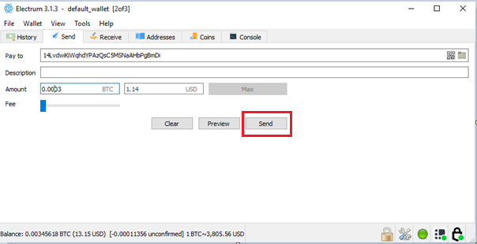

Sign and confirm the transaction with one Hardware Wallet at the time, start with Hardware Wallet A. Control the information (like address and amount) on the hardware wallet.

Once confirmed, your transaction should be broadcasted!

### Withdrawal method 2

This is the backup method and should only be needed in case you lose one hardware wallet and its seed or passphrase. This makes sure that our third seed works and that it was transferred properly to our main computer.

In Electrum, go to send, enter an address to another wallet you control. Select the rest of the test amount you have left in the wallet by clicking "Max", pick a fee and select “preview”:

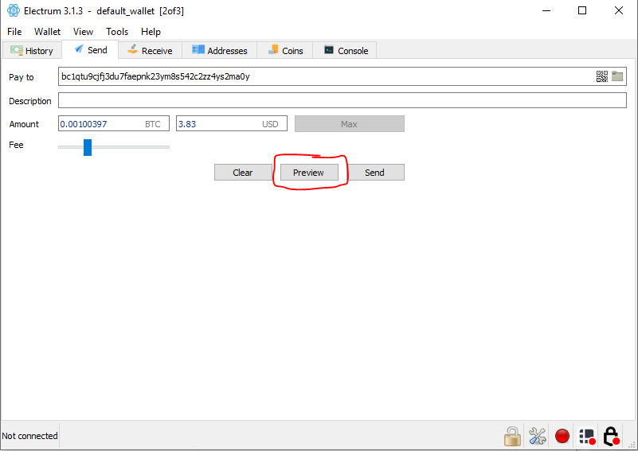

In the preview window, select the QR-code in the bottom left corner:

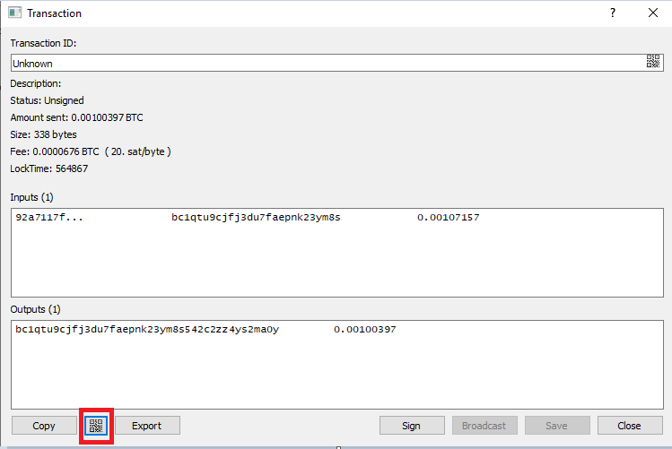

That should bring up the QR-code. Take a photo of the QR-code with your phone. Close the Transaction dialog.

Then, go to `Wallet>Information`. Click the QR-code for the key from cosigner 1. Take a photo of this QR-code as well:

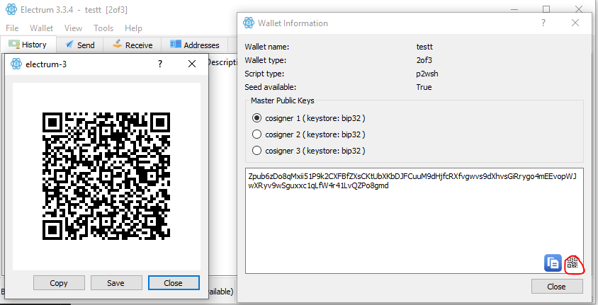

This'll only be used to create a "dummy wallet" in Tails and could be any master public key.

So, we are now going back to Tails. Go to your second computer or restart your main computer on Tails. We are going to handle a secret seed, make sure to follow the same procedure that you used when generating the seeds (that no one can see what you do). In Tails, launch Electrum [like before](https://github.com/DriftwoodPalace/guides/blob/master/hodl-guide/hodl-guide_30_last-seed.md#run-electrum-on-tails). If you still have Tails running, you can use the "up arrow" key in the terminal to see previous commands.

Click next at the first window:

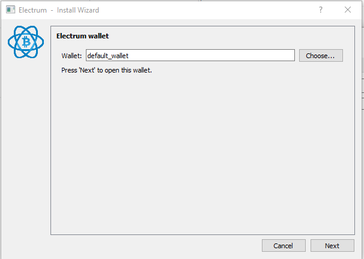

Select "Multi-signature wallet" and click Next:


Let 2 cosigner with 2 signatures be selected and click Next:


Select “I already have a seed” and click Next:


Enter your 12-word seed on the next screen and click Next:


That should bring up your Master Public Key, click Next:

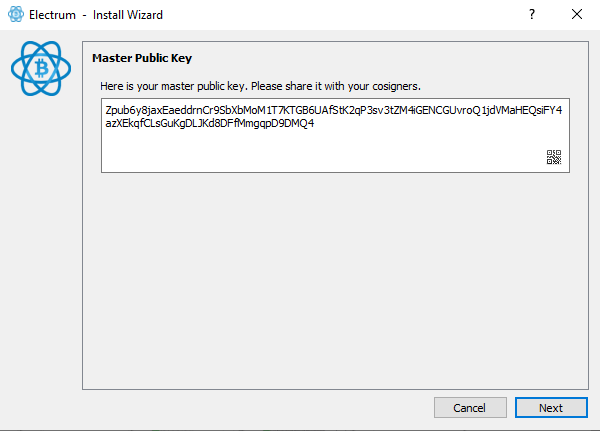

You should be asked about cosigner 2. Let "Enter cosigner key" be selected and click Next:

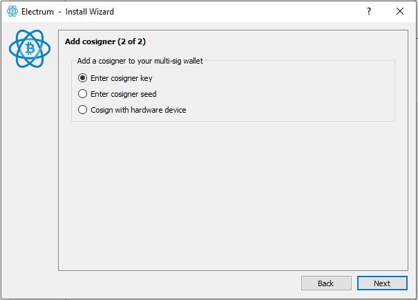

Click on the camera in the bottom right corner of the field. That should bring up the camera on the laptop. Bring up the photo with the QR-code of the master public key (the last photo). When the QR-code is read, click Next:

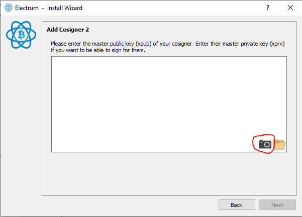

You should now be asked for a password. Leave the password field empty (the wallet file will be deleted once finished) and click Next:

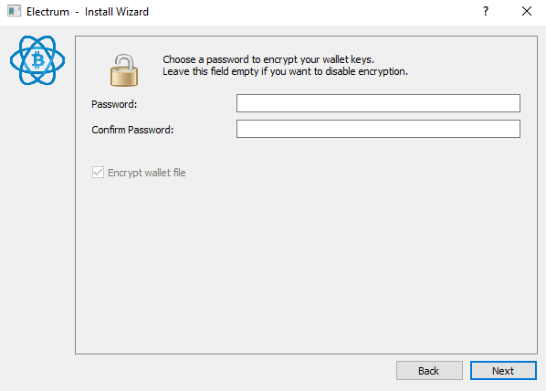

The wallet should now be created (can take a while). Once open, go to `Tools>Load Transaction>From QR code`.

Scan the QR code with the transaction on your phone/camera.

That should bring up the same Transaction Window that you had on your main computer/OS. If you get an error, check that the Electrum version is the same in Tails as on your main computer.

Start by first clicking “Sign”. That should Sign the transaction.
Then click the QR-code:

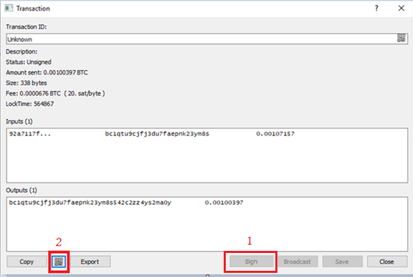

Take a photo of the QR-code with your phone.

Your transaction is now signed and you can close Electrum and Tails (we won’t be using it anymore). Remove both USB flash drives from the computer to close Tails and delete all sensitive information.

Go back to your main computer and open your multi-sig wallet in Electrum. Go to `Tools>Load Transaction>From QR code` and scan the last QR-code. You might have to start Zbar and select a camera for the camera to work (and it might be slow to start, so try 2-3 times).

*Note*, if you are using another way to scan the QR-codes. Scan the QR-code outside of Electrum. In Electrum, go to `Tools>Load Transaction` and paste the text.

That should bring up the transaction window.

Connect one of your hardware wallets and click sign. Follow the instructions on your Hardware Wallet, control the address and the amount, and sign the transaction.

If you are using Hardware Wallet B to sign, you’ll probably get a message like this:


Select `No` and wait for Electrum to detect Hardware Wallet B. Once detected, click `Sign` and follow the instructions on your Hardware Wallet (this process can be rather slow). Once signed, wait for Electrum to calculate everything. 

Once calculated, click `Broadcast`:

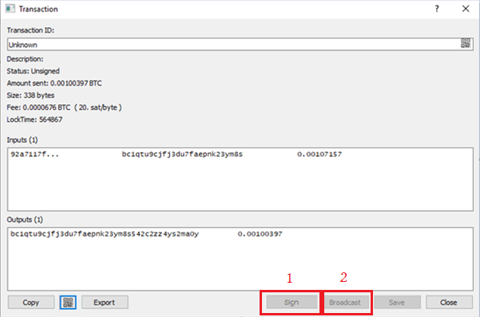

Your transaction should be broadcasted to the network!

## Update information packages

Before moving on, we need to fill in the last information in our information packages.

With your wallet open in Electrum, go to `Wallet>Information`.

In your `digital note` add all master public keys, like this:

```
MPK1: Zpub668...
MPK2: Zpub78e...
MPK3: Zpub87t...
```

In `information package A` add the master public key from cosigner 3:

`MPK3: Zpub87t...`

This is backup for the backup, but should still be treated with care. It's easy to miss one character if typing it by hand. Consider printing it on a printer, if you own one, and attaching it to the note. Otherwise double check what you type.

In `information package C` add the master public key from cosigner 2:

`MPK2: Zpub78e...`

That’s it! Finish by deleting all the pictures of QR-codes on your phone or camera.

---

Next up: [Storage >>](hodl-guide_50_storage.md)
