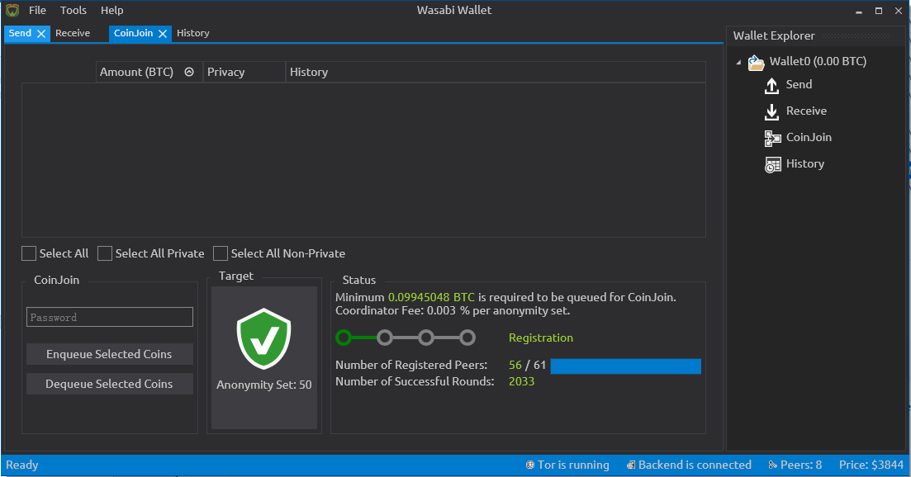

[ [Intro](README.md) ] -- [ [Preparations]( hodl-guide_10_preparations.md) ] -- [ [First Seeds](hodl-guide_20_first-seeds.md) ] -- [ [Last Seed](hodl-guide_30_last-seed.md) ] -- [ [Multi-Sig](hodl-guide_40_multi-sig.md) ] -- [ [Storage](hodl-guide_50_storage.md
) ] -- [ **Bonus** ] -- [ [Troubleshooting](hodl-guide_70_troubleshooting.md) ]

---

# Wasabi Wallet

Wasabi Wallet is a bitcoin wallet designed with privacy in mind. The wallet gives the user control of different "UTXOs". A UTXO is simply an unspent transaction output and is often referred to as "coin" (and is what makes up individual bitcoins). UTXOs are associated with bitcoin addresses and can be traced on the blockchain. This can be used to track users and try to determine who owns what. The most common heuristics for tracking users can be broken if you "mix" your UTXOs with other peoples UTXOs (and use the same amounts). The method is often referred to as "coinjoin" as is a service Wasabi Wallet offers as well.

Most implementations of coinjoin (sometimes called mixers) is by third parties that control the whole process. That means that they can steal your funds and destroy your privacy if they like (you have to trust them). This is not the case with Wasabi Wallet. The only central part is a "coordinator" that constructs the transactions and that you connect to with Tor to ensure anonymity. You control your own private keys during the whole process.

Mixing bitcoin is extra important if you bought them at an exchange that use KYC (know your customer). In that case, you'll have your name and maybe even address attached to a set of UTXOs and you can never know who has that information. This might later get mixed with funds in another wallet you control and parts, or all, of those funds might be linked to you. This can to a large degree be fixed if you use Wasabi Wallet.

To download and install the wallet, go to [WasabiWallet](https://www.wasabiwallet.io/) and download the latest version for your OS. If you use Tor, use the [.onion address](http://wasabiukrxmkdgve5kynjztuovbg43uxcbcxn6y2okcrsg7gb6jdmbad.onion/)
Make sure that you download the detached signature as well so we can verify the download.
To verify the signature, you need GnuPG and the signing key from nopara73.
If you don’t have GnuPG, you can find basic instructions [here](https://github.com/DriftwoodPalace/guides/blob/master/hodl-guide/hodl-guide_30_last-seed.md#download-gnupg-for-validating-digital-signatures).

You can find nopara73’s key on Wasabi Wallets [Github page](https://github.com/zkSNACKs/WalletWasabi/blob/master/PGP.txt). Click Raw and use Ctrl(or Cmd)+S and save the key in the same folder as your downloaded files.

Once done, open a new terminal window:

*Windows*: Open Powershell (search for it or use Win+R, type powershell and hit enter)

*macOs*: Click the Searchlight (magnifying glass) icon in the menu bar and type terminal. Select the Terminal application from the search results.

*Linux*: Varies, on Ubuntu, press Ctrl+Alt+T

Change the current directory to the one where the 3 downloaded files are located, for example:

 `$ cd ~/Downloads`

Import PGP.txt to your local GPG installation:

`$ gpg --import pgp.txt`

Now use the “detached signature” (.asc) to check that the installation file you downloaded was signed with the signing key we imported (change the name of the files if you use a different version):

`$ gpg --verify Wasabi-1.1.1.msi.asc Wasabi-1.1.1.msi`

The expected should be something like:

```
gpg: Signature made 02/12/19 10:44:50 W. Europe Standard Time
gpg:                using RSA key 21D7CA45565DBCCEBE45115DB4B72266C47E075E
gpg: conversion from 'utf-8' to 'CP437' failed: Illegal byte sequence
gpg: Good signature from "Fics≤r ┴dßm <adam.ficsor73@gmail.com>" [unknown]
gpg: WARNING: This key is not certified with a trusted signature!
gpg:          There is no indication that the signature belongs to the owner.
Primary key fingerprint: 21D7 CA45 565D BCCE BE45 115D B4B7 2266 C47E 075E
```

We can see that the signature was made close to the release (by checking the date) and that it´s a `Good signature`. The fingerprint matches the one written in the [documentation](https://github.com/zkSNACKs/WalletWasabi/blob/master/WalletWasabi.Documentation/Guides/InstallInstructions.md#gpg-verification).

We can go ahead and install Wasabi Wallet.

Once finished, run Wasabi Wallet. Generate a new wallet according to the instructions on screen. Remember, this is a hot wallet. Never put to much bitcoin in a hot wallet.

Open your wallet and change tab to CoinJoin:



When you deposit funds to Wasabi Wallet, you’ll see the unspent outputs that you can queue for mixing here. Select the outputs you want to mix, enter your password and Click `Enqueue Selected Coins`.

Your funds will now automatically be mixed until they reach your desired anonymity set. "Anonymity set" refers to how many other outputs of the same amount you mix our coins with (if 50 people participate in the coinjoin, the anonymity set is 50). The lowest amount available to mix right now is 0,1 bitcoin. If you mix larger amounts, the change will be mixed as well and improve your anonymity set.

You can safely transfer bitcoin from WasabiWallet to your cold storage. As you can see in the bottom of the screenshot ("Tor is running"), Wasabi ships with Tor and can't be used without it. So all transactions are broadcasted over Tor which will hide your IP-address.

Wasabi wallet truly is best in class when it comes to "light wallets" (wallets that doesn't download the whole blockchain) and privacy. It gets your wallet balance by downloading a filter from Wasabis server ("Backend is connected"). The wallet can from the filter figure out what blocks to download. It then asks different Bitcoin full nodes ("Peers 8") for the blocks it needs. Everything is done over Tor which ensures anonymity. If you have a full node running it will automatically try to download the blocks from that node to increase privacy even more.

## Best practises to handle mixed outputs

Depending on how much you mix and what anonymity set you settle for, you´ll end up with a lot of smaller outputs. If you deposit 1 bitcoin and mix to the smallest denominator, you’ll end up with 10 0,1-bitcoin outputs.

So, how should you handle withdrawals to cold storage and mixing in general? If you mix larger amounts, don’t withdraw all your mixed bitcoins in the same transaction. The key is to be unpredictable. Chain analysis companies are looking for patterns. So, avoid depositing and withdrawing the same amount. If you deposit 1 bitcoin and mix it, don't combine all the mixed outputs to transfer 1 bitcoin out in the same transaction. You would still have improved your anonymity from the mixing but you can improve it even more if you deposit 1 bitcoin, mix it and withdraw in batches of say 0,3, 0,5 and 0,2 bitcoin during different times. Some guidelines:

* Be unpredictable. If you have 5 bitcoins, deposit it in uneven chunks (and generally, don’t put 5 bitcoins in a hot wallet). For example, start by depositing 1 bitcoin, then 0,7 then 1,2 and so on. Do the transactions at different times during the day.
* Aim for an anonymity set of at least 50. This’ll be visible at each separate UTXO in Wasabi Wallet.
* If you’ve mixed 5 bitcoins, you'll probably end up with 50 outputs of 0,1 bitcoin. If you were going to transfer all out individually, you’d have to do 50 different transactions and would end up with many smaller UTXOs (that could give you larger fees down the line). Is it safe to combine some of the outputs when withdrawing? Again, the key is unpredictability. You can probably combine 5-10 outputs of 0,1 bitcoin without reducing your privacy too much. But, make sure to change your behaviour (sometimes transfer 0,3 bitcoin, next time 0,5 and so on). Do the transfers at different times during the day and never deposit to old addresses (addresses you've used before).
* *Advanced:* If you mix some of your outputs more then once it will sort of grow your anonymity set exponentially and make tracking much harder. This won’t cost much and makes you more unpredictable. The easiest solution is to change the `config.json` file. With Wasabi Wallet open, go to `File>Open>Config File`. Change the line `MixUntilAnonymitySet` from `50` to a number of `100` or more and save the file. To be even more unpredictable, change this number from time to time. Restart Wasabi Wallet for the new changes to effect.

---

<< Back: [Bonus guides](hodl-guide_60_bonus.md)
