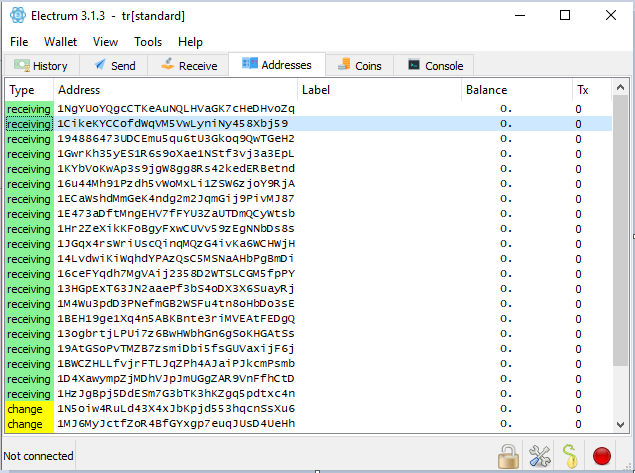

[ [Intro](README.md) ] -- [ [Preparations]( hodl-guide_10_preparations.md) ] -- [ [First Keys](hodl-guide_20_first-keys.md) ] -- [ [Last Key](hodl-guide_30_last-key.md) ] -- [ [Multi-Sig](hodl-guide_40_multi-sig.md) ] -- [ [Key storage](hodl-guide_50_key-storage.md
) ] -- [ **Bonus** ] -- [ [Troubleshooting](hodl-guide_70_troubleshooting.md) ]

---

## Add watch address in Bitcoin Core

*Difficulty: easy*

Watch addresses can be used to verify payments with your own full node without giving it any private keys. You simply load the addresses it should keep track on. This can be useful if you use a Hardware Wallet or a multi-sig wallet created in Electrum. An even better solution is to use Electrum Personal Server (that way you can broadcast transactions as well). You can find guides for EPS here ([Windows](hodl-guide_63_eps-win.md), [Mac](hodl-guide_63_eps-mac.md), [Linux (not my guide)]( https://www.youtube.com/watch?v=1JMP4NZCC5g)

To begin, make sure you have Bitcoin Core installed and synced (guide [Here]( hodl-guide_61_bitcoin-core.md). Open Bitcoin Core and go to Help> Debug Window and change the tab to “Console”:

If you are using Electrum to generate addresses, go to the tab “Addresses”. How many addresses you need depends on how many transfers you are going to do into the wallet (never reuse addresses). But a good starting point can be to copy all receiving addresses:

In the Bitcoin Core window, type (and change the address to your address):

`importaddress 3EFvJremRxxqfhYU5hheRyCvxBV8rQBhwC Label false`

You’ll have to do this for every address you want to import.  This will keep track of all future transactions to these addresses. If you want to import addresses that contains old transaction, change the last imported address to Label true, like:

`mportaddress 1HzJgBpj5DdESm7G3bTK3hKZgq5pdtxc4n Label true`

This will rescan the blockchain for any previous transactions. If you are using a pruned node, the rescan probably won’t show all transactions.

------

<< Back: [Bonus guides](hodl-guide_60_bonus.md) 
