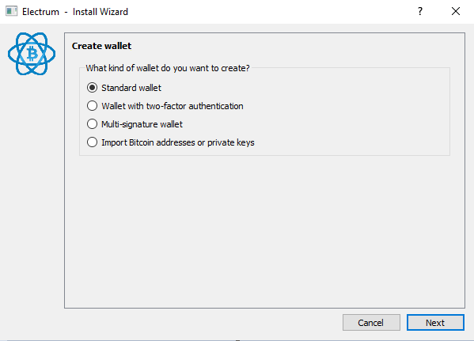
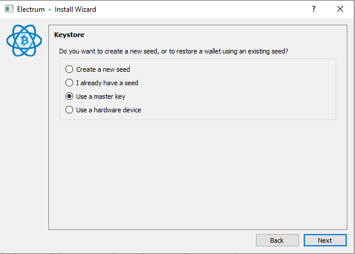
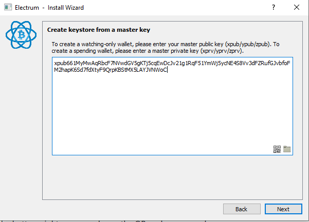
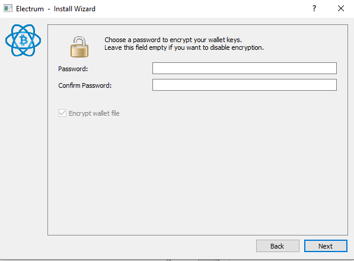

[ [Intro](README.md) ] -- [ [Preparations]( hodl-guide_10_preparations.md) ] -- [ [First Seeds](hodl-guide_20_first-seeds.md) ] -- [ [Last Seed](hodl-guide_30_last-seed.md) ] -- [ [Multi-Sig](hodl-guide_40_multi-sig.md) ] -- [ [Storage](hodl-guide_50_storage.md
) ] -- [ **Bonus** ] -- [ [Troubleshooting](hodl-guide_70_troubleshooting.md) ]

---

## Setup Electrum to run over Tor

*Difficulty: easy*

Electrum works by connecting to special purpose servers. 
Anyone can run a server and if you don’t specify a server, you’ll be connected to one randomly. Every address in your wallet is sent to the server so it can check for the current balance. Your addresses are *hashed* before they are sent to the server, but that only helps until an address is used for the first time. 

Every transaction you do is, by default, broadcasted through the server.

This is bad for privacy (and has been used for phishing attacks with a bug that's now patched).

If you don’t use Tor or a VPN, one or more random servers will know all of your transactions, your wallet balance and your real IP-address. 

There're several companies that specialises in chain analysis to deanonymize addresses and we can assume that they’re running several Electrum Servers. 

If you bought your bitcoin on an exchange that use KYC (know your customer), you can assume that these companies have your name, address and IP-address. If you then connect to one of their servers and ask for the balance on a number of bitcoin addresses, it's trivial for them to connect those addresses to you. It doesn't matter what you have done between you had the bitcoin on the exchange, or even if it's the same bitcoin. They can still assume it is your wallet. 

Tor isn't a foolproof method for solving this, but it improves your privacy as it takes your IP-address out of the equation.  

Unfortunately any old wallet you've used without Tor (or a VPN) should be treated as "compromised" regarding privacy. The hashes of at least your 20 first addresses will be known to some servers and they can easily monitor those for activity even after you've disconnected from their server. You can generate new addresses in Electrum, but it's almost always easier to create a new wallet (as you have to move your funds anyway). This is why I recommend starting Electrum with a "dummy wallet" or an old wallet and setting up Tor before creating your cold storage wallet. You can of course keep using an old wallet, it's still an huge improvement compared to keeping your bitcoin on an exchange or in a web wallet. At least, now you know what some of the risks are and can adjust that to your situation. 

### Install Tor

Tor uses "onion routing" to hide your real IP-address. 
You can also use a VPN, both solutions will hide your real IP-address from random servers. 
With a VPN, you'll trust the provider (all traffic goes through them) which is probably safe in most situations (but you never know what information they store). If you like you can use a VPN+Tor. This guide will use Tor as it's free and generally seen as a better alternative.

Using Electrum with Tor should be a fairly straightforward process and we might as well do it from the start. If you don't have Tor, go to https://www.torproject.org/projects/torbrowser.html and download the latest version of Tor Browser for your OS. You should now know how to verify digital signatures. So, download the signature (.asc) for the file you download as well. You can import the Tor signing key with the command:

`gpg --keyserver pool.sks-keyservers.net --recv-keys 0x4E2C6E8793298290`

Then use:

`gpg --verify {your_file.asc}`

Make sure the output is similar to this:
```
gpg: assuming signed data in 'torbrowser-install-win64-8.0.6_en-US.exe'
gpg: Signature made 02/12/19 14:26:17 W. Europe Standard Time
gpg:                using RSA key EB774491D9FF06E2
gpg: Good signature from "Tor Browser Developers (signing key) <torbrowser@torproject.org>" [unknown]
gpg: WARNING: This key is not certified with a trusted signature!
gpg:          There is no indication that the signature belongs to the owner.
Primary key fingerprint: EF6E 286D DA85 EA2A 4BA7  DE68 4E2C 6E87 9329 8290
     Subkey fingerprint: 1107 75B5 D101 FB36 BC6C  911B EB77 4491 D9FF 06E2
```

When Tor is installed, start Tor. That could be done in two ways. You can launch the browser (it’s much easier to use then a few years ago) or only start Tor (like tor.exe on Windows). Only Tor should be located at `.\Tor Browser\Browser\TorBrowser\Tor`. You won't notice anything if you launch Tor without the browser (nothing visible will start).

### Setup Electrum

Start Electrum. To access the settings in Electrum, you need to open a wallet. 

If this is the first-time using Electrum, you'll have to create a wallet (skip these steps and open a wallet if you already have one). The wallet you create can be a "dummy" wallet that you delete after the process. We only use this wallet to access the settings so you don't connect to random servers with your real IP-address (and give them all your addresses) once your cold storage multi-sig wallet is created.

Pick a name for the wallet, click Next:


Let Standard Wallet be selected, click Next:



Change to "Use a master key" and click Next:



Since we only want a dummy wallet to access the settings, paste this key in the field and click Next: `xpub661MyMwAqRbcF7NVwdGV5gKTj5cqEwDcJv21g1RqF51YmWj5ycNE4S8Vv3dFZRufGJvbfoFM2hapK6Sd7fdXtyF9QrpKBStMX5LAYJVNWoC`



We don't need a password for this wallet, leave the field blank and click Next:



Electrum should now start.

In Electrum go to `Tools>Network`. Change the tab to `Proxy`. Select "Use Proxy" and make sure `SOCKS5` is `127.0.0.1` and that the port is `9050`:


Close the network dialog. The circle in the bottom right corner should now be blue and not green. You have now configured Electrum to run over Tor. Electrum won’t connect to anyone unless Tor is running (even if you restart it). You still rely on third parties for validation and broadcasting, but they won't see your real IP-address.

*Troubleshooting:* If you aren't getting a blue circle or any connections try changing the port to `9150`. Tor can sometimes use this port on Windows.

------

<< Back: [Bonus guides](hodl-guide_60_bonus.md) 
