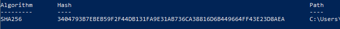
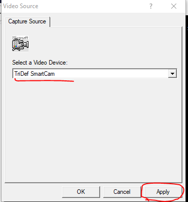

[ [Intro](README.md) ] -- [ [Preparations]( hodl-guide_10_preparations.md) ] -- [ [First Seeds](hodl-guide_20_first-seeds.md) ] -- [ [Last Seed](hodl-guide_30_last-seed.md) ] -- [ [Multi-Sig](hodl-guide_40_multi-sig.md) ] -- [ [Storage](hodl-guide_50_storage.md) ] -- [ [Bonus](hodl-guide_60_bonus.md) ] -- [ **Troubleshooting** ]

---

# Scan QR-code with Electrum

If you try to scan a QR-code with Electrum and get the following error:

You’ll probably need to install “Zbar” (or launch it if it’s installed). 

If you can’t launch (not available on Mac) or don’t want to use Zbar, you could use a workaround. 

*Option 1:* Download another QR-reader on your computer (or check if you have one installed) and scan the QR-code. Copy the scanned result to Electrum. 

*Option 2:* Use a QR-code reader on your smart-phone. Load the photo to the QR-code reader, connect to internet and send the text to your computer with a secure messaging app like Signal. We are not scanning any really sensitive information (1 of 3 master public keys or a pre signed transaction), so sending it with e-mail or a normal messaging app works as well. 

*Option 3:* use an online-service like https://webqr.com/index.html. Know that you risk to leak anything you scan to the service (but again, not super sensitive information). Copy the result to Electrum.

### Install Zbar

If you want to install Zbar, it’s available at http://zbar.sourceforge.net/ and you can view the source code at https://github.com/ZBar/ZBar. It’s generally a good idea to not download random programs from file hosting sites. But Zbar has been around a long time and we can try to ensure it’s a legit copy. Go to https://sourceforge.net/projects/zbar/files/zbar/0.10/. Make sure that “Modified” is 2009-10-XX:

Download the file for your operating system (.exe for Windows and tar.gz or tar.bz2 for Linux). No digital signatures are provided, so we are going to generate the SHA256-checksum of the file. Open a new terminal and change the directory to where the file is located:

`$ cd $HOME/Downloads`

Generate the checksum:

*Windows:* `> Get-FileHash -a sha256 zbar-0.10-setup.exe`

You should get the following output: 

*Linux:* `$ sha256sum zbar-0.10.tar.gz`

Should produce the output:

`575fa82de699faa7bda2d2ebbe3e1af0a4152ec4d3ad72c0ab6712d7cc9b5dd2  zbar-0.10.tar.gz`

And:

`$ sha256sum zbar-0.10.tar.bz2`

Should produce the output:

`234efb39dbbe5cef4189cc76f37afbe3cfcfb45ae52493bfe8e191318bdbadc6  zbar-0.10.tar.bz2`

It’s the best we can do here and Zbar won’t be handling any critical information. If the hashes match, you know that you’ve got the same file that was used in this guide. If you are okay with that, go ahead and install Zbar and follow the instructions on the screen. Go back to Electrum and click the QR-code, you might have to try 2-3 times before it starts.

If it still doesn’t start, start the program “zbarcam”, pick a video source, click apply and try 2-3 times in Electrum again:

Scan the QR-code in Electrum. It should read your xpub key and Electrum should automatically show it.

---

<< Back: [Create multi-sig wallet](https://github.com/DriftwoodPalace/guides/blob/master/hodl-guide/hodl-guide_40_multi-sig.md#create-the-multi-sig-wallet)
