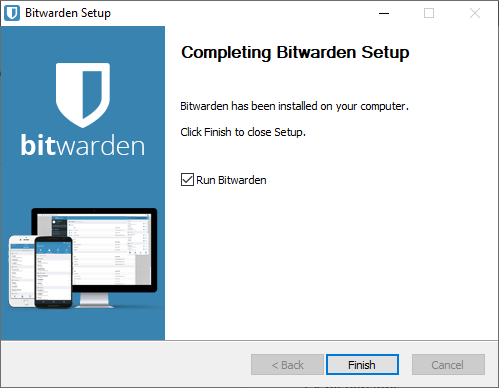
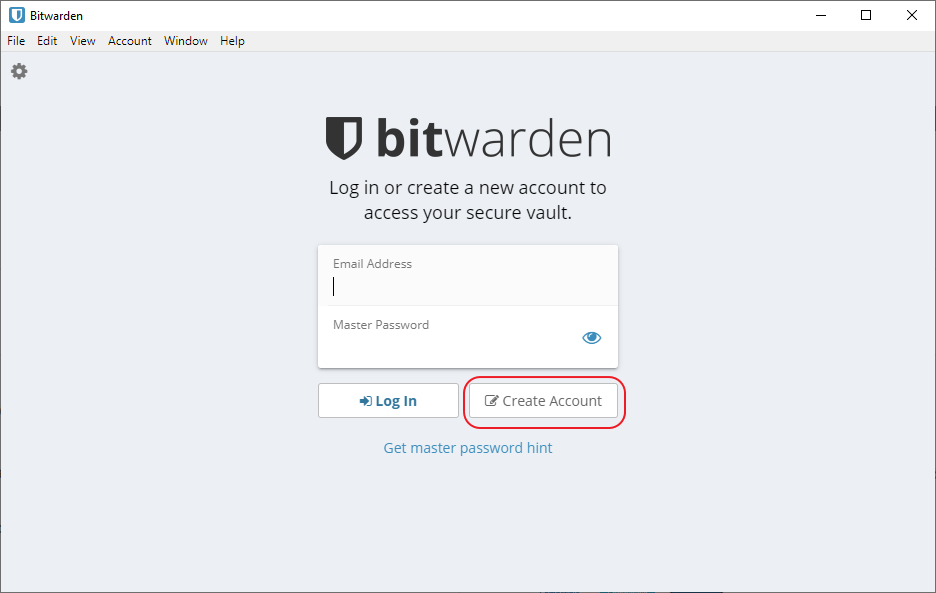

# Generate password, passphrase and PINs
{: .no_toc }

## Table of contents
{: .no_toc .text-delta }

1. TOC
{:toc}

## Create password and passphrase

Before doing anything with any hardware wallet, we are going to generate two strings of text and three PIN-codes. We are calling the first one `Wallet Password` (called `PW` from now on) and the second one `Passphrase Hardware Wallet` (called `PF-HW` from now on). Both are essentially a password. But the last one will be used together with the seeds as a "25th word". When used to encrypt a seed like that it's usually called a passphrase, so we are sticking with that. We are going to use the same passphrase with all our seeds. Using a separate passphrase for each seed would of course improve the security even more. But at the same time. it creates more to store and increases the risk of making the setup to complicated. As always, it's a trade off.

Humans are usually terrible at generating (and remembering) passwords so we are using a password manager to help with that process. We are going to use "Bitwarden". It's an "online password manager" and we use it because we want remote access (so you don't loose valuable information if your house burns down or something). Nothing you put in the password managers can solely be used to access any funds. But, they can be used to reduce your privacy. With the information in the managers, you'll be able to view how much bitcoin is in your wallet (but not move any funds). Except for the generated passphrase, we are NOT storing any information about the seeds on any computer connected to the internet. This is what the specific purpose hardware wallets are for.

Bitwarden is an open source password manager that stores everything in "the cloud" (someone else's computer). It's not optimal to store any information about Bitcoin in "the cloud". But, it's a trade off we are taking here to reduce the risk of loosing any funds.

So, go ahead and download Bitwarden for your operating system https://bitwarden.com/#download

Install and run the application:

Then create a new account. Do this even if you already have an account with Bitwarden. We want an account that's only used for this purpose to connect as little as possible to our real identity. Do not use an e-mail with your name in it or that's easy to connect to your real identity. This'll somewhat protect you in case of any data leaks. For this account, use a password you'll remember. The information in this password manager is for your eyes only:

When the account is created, go to `View > Password Generator` and copy the generated password:

Close the dialog and click `Add item`, select `Secure Note`, give it a `Name` and in the `Notes` field, type `PW: ` and past the password/passphrase you generated before. This password will be used to create a backup secure note later on:

Go back to `Password Generator` and click `Options`, change the Password Length to `20` (this will give you a lot of entropy and make it very expensive to brute force the passphrase). Make sure the generated passphrase is without symbols that can be confused like big o and zero. That should be the default setting:

Copy the generated password and go back to your note. Type `PF-HW: ` and paste the generated password:

## Select PINs
The last thing we'll do is to select 3 different PIN-codes that we can use when setting up the Hardware Wallets. The PINs aren't as important as the passphrase to be completely random and very strong. The hardware wallets are constructed so you'll only get a few chances to enter the correct PIN before they lock themselves. So, the PIN can be fairly week and you can still be safe. We don't want to put all PINs in cleartext in our password manager. If someone, somehow, got access to that they would "only" need our hardware wallets to access our funds (as we store the passphrase in the manager as well).

So, we are storing hints in the password manager. The PINs should be at least 6 characters and you can use your imagination a bit here. Use Bitwardens Password Generator if you like. For example, use a PIN you know you'll remember (say it's `8767`) for the first four digits. Add four random generated digits to that number (say it's `8626`). Then you could add `PIN-Coldcard: StdPIN+8626` to your note. You will be writing the full PINs down on your notes later. So, don't use PINs that you don't like to write down (that might be for some other application).

Do the same two more times so you'll end up with something like this:

Make sure to save the note before moving on. We have now generated the password, the passphrase and the PINs we'll use during the process and can move on to actually creating our private seeds.

---
Next up: [Generating your seeds >>](hodl-guide_30_last-seed.md)