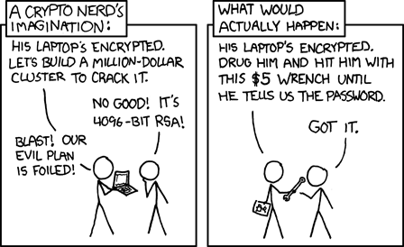

# Store your information

You've now created all necessary information. You can put the seeds into envelopes and seal them with tamper resistant tape if you like. Mark them `A`, `B` and `C`. This should give you the following setup:

* **Envelope A:**
  * `Seed A - Coldcard`, `PIN Coldcard` and `PW`
* **Envelope B:**
  * `Seed B - Trezor`, `PIN-Trezor` and `PF-HW`
* **Envelope C:**
  * `Seed C - Ledger` and `PIN-Ledger`
* **4:**
  * `Hardware Wallet Coldcard` (containing seed A)  
* **5:**
  * `Hardware Wallet Trezor` (containing Seed B)
* **6:**
  * `Hardware Wallet Ledger` (containing Seed C)
* **7:**
  * One `Digital note` in Bitwarden containing:

  ```
    PW: your_wallet_password
    PF-HW: your_hardwarewallet_passphrase
    PIN-Coldcard: hint_pin_coldcard
    PIN-Trezor: hint_pin_trezor
    PIN-Ledger: hint_pin_ledger
    Derivation path: m/48'/0'/0'/2'
    MPK1: your_master_pub_key_1
    MPK2: your_master_pub_key_2
    MPK3: your_master_pub_key_3
  ```
* **8:**
  * One USB-flash drive with the `secure offline note` (with the same information as the note in Bitwarden) and a copy of your Electrum wallet file

## Storage plan

We need to understand what's required to spend anything from your coldstorage. It's a 2 of 3 multi sig. This means that you'll need two signature to spend anything. 

A signature can be created with your hardware wallet and the passphrase or the 24 word seed and the passphrase.
Two signatures isn't in itself enough. You'll need to know the master public key of the third key as well. As you've seen, the master public keys are stored in your Electrum wallet. So, the easiest way to spend is:
* Using your Electrum wallet and two signatures.

If Electrum somehow disappeared from the internet, your funds would still be safe. There's tools to restore your wallet with another software (for example https://unchained-capital.github.io/caravan/#/). This could be the case if you lost access to your Electrum wallet and want to create a new one as well. So, the second way to spend anything is with:
* Two signatures, the master public key from the third key (or access to the seed+passphrase) and the derivation path.

When it comes to privacy, like seeing the wallet balance, it's pretty simple. If you have one seed+the passphrase or one master public key you will be able to see all transactions. There's still a lot of work left if they only have one key. *Exactly why* it's this way is an advanced topic that isn't really necessary to understand. But they would have to scan 


This plan will give you the option to easily spend from your cold storage. You can of course modify this 

**1.** `Envelope A` (Seed A - Coldcard). Store it with someone you trust. This envelope has the password to your secure note and wallet file on the USB-stick. If the person holding this envelope got their hands on the USB, they would be able to open the wallet and see your full balance (but wouldn't be able to spend anything). If they got their hands on your Coldcard they would be able to unlock it. As the passphrase is stored on the device they would then be able to scan the blockchain for any *old* transactions that was made with that key. They could then guess that some change amount might belong to you as well. The risk for this'll be reduced if you follow the best practises at [Electrum best practises](hodl-guide_67_electrum-bp.md). They wouldn't be able to see unspent transactions in the wallet.

**2.** `Envelope B` (Seed B - Trezor). Store it with someone else you trust or in a different location then your home (bank, second location you control etc). This envelope has the passphrase used with all 3 seeds. Using the passphrase and the seed the one holding this would be able to see *old* transactions (the same situation described above with the Coldcard). They would be able to unlock the Trezor with the correct passphrase as well, but that would only put them in the same situation as holding the seed+passphrase.

**3.** `Envelope C` (Seed C - Ledger). Store it in a vault or a safe deposit box at a bank or with a specialized company. The person or entity holding this wouldn't be able to do much. They wouldn't have the passphrase or password to unlock anything else.

**4.** Store your Coldcard, Trezor, Ledger and USB-flash drive in your home (preferably in a safe). This gives you the possibility to spend from your cold storage at any time and you can use the Trezor for double checking addresses when depositing to your cold storage as well.

**5.** Digital note, encrypted and stored in "Bitwarden".

You can of course modify this to fit your situation (only use persons you trust, only use vaults etc). But you shouldn't store any seeds in the same building as the hardware wallets.

I would say that this is a solid setup. No single fiduciary can access your funds or even see your full balance. You can yourself fully control your funds from your home and it's easy to regularly control your hardware wallets. You can reconstruct your multi-sig wallet with one of your digital notes and any two hardware wallets or seeds.

If someone steals your hardware wallets, they would still need two of your PINs and access to one of the digital notes (or all three PINs).

The persons holding seed A and seed B could collaborate and come pretty far. But they would still miss the master public key for the third key. They would need access to the USB-flash drive or seed C to be able to spend anything. 

If other people store information for you. Try to deliver the information yourself, never put anything in an e-mail. In the worst case, mail the packages one at a time with snail mail and confirm that they are delivered properly. Tell the persons that are holding the packages what it is and who they need to contact in case of an emergency where they need to access the funds.

Avoid writing “Bitcoin” or something on the outside of the envelopes, they should look as normal as possible. If you suspect that one of the packages is lost or compromised, immediately move your funds to a new multi-sig wallet .

*Optional:* Inspect the packages stored in other locations once a year. Make sure that no seals are broken. If something looks compromised, create a new multi-sig wallet and move your funds.

Everything is now set to start to HODLing with a peace of mind!

For guidelines on how to handle deposits, withdrawals and more with Electrum. Check out [Electrum best practises](hodl-guide_67_electrum-bp.md) in the Bonus section.

## Worst case scenarios

So, what are the worst case scenarios? How vulnerable are you to theft or loss and how are your trusted persons going to access your funds in case of an emergency?

### Theft by random attacker

Your funds are most vulnerable to the famous "$5 wrench attack":



*$5 wrench attack by [xkcd](https://xkcd.com/538/)*

There's no silver bullet to avoid this type of attack. The best defence is probably to keep a low profile. Never talk about how much bitcoin you own or if that's the case, how early you bought bitcoin (that's not very classy anyways).  You could try playing around with a setup of decoy PINs or decoy wallets that's offered by some hardware wallets. But that's beyond this guide.

A truly worst case scenario is if an attacker knows about some, or all, bitcoin you own and attack you. Decoys would then be a useless. That could happen if they got access to all your master public keys and your name or address. It could also happen if you where deanonymized because of bad privacy practises.

For example, if an chain analysis company manages to tie a certain cluster of addresses to your identity. The attacker could then be the government that demands that you reveal your addresses for some reason. This risk is reduced a lot if you use your own full node over Tor and follow some best practises when handling funds. Even without all those precautions, it's still an huge improvement compared to status que where a random bank employee can get access to all your financial information with a few clicks.

Important to remember, your funds aren't at risk only because your computer is compromised. As long as two of the hardware wallets do what they are designed to do (not leak the seed), your funds are safe. An attacker would need you to give them access to the funds (physical attack or social engineering).

### Theft by trusted persons

If the people you trust with your information where going to collude against you and can't access your home, they would need all 3 packages to steal anything. The persons holding package A and B could collaborate and would be able to access your funds if they got access to your USB-flash drive. 

### Access in case of an emergency

What if someone needs to access your funds in case you are hospitalized or worse?

We assume that they are able to find this guide.

The worst case scenario (for both you and your funds) would be if your house burns down and you and your hardware wallets with it. All three seeds stored in other locations would then be needed to access your funds. The multi-sig contract could be reconstructed by combining all seeds (+ the seed passphrase) in the right order.

If you are in a coma or die (without your house burning down) and a fiduciary needs to access your funds, access to Envelope A is needed. If we assume that the person can get access to your USB-flash drive (drill the safe or whatever is needed). The person can combine Envelope A with Envelope B and use the wallet-file on the USB (or the information in the note) or with Envelope C and use the information in the note to recover the wallet.

What about loss of seeds?

If your house burns down and your hardware wallets and USB with it (but you survive). You'll be able to restore your wallet with wallet with the information in your digital note in Bitwarden and two of the seeds.

If your computer crashes and you lose access to your electrum wallet file and you somehow lose your digital note, you can reconstruct the wallet with two hardware wallets and your USB-flash drive.

To lose your funds in a normal situation, two fiduciary needs to lose the seed at the same time as the two corresponding hardware wallet stops working or disappears.

That should be most of the situations. If you see any flaws in the reasoning or can think of any other edge cases that could be important, please open an issue.

Otherwise, thanks for following the guide. I hope it was helpful!

---

For more improvements to the guide check out: [Bonus >>](hodl-guide_60_bonus.md)
