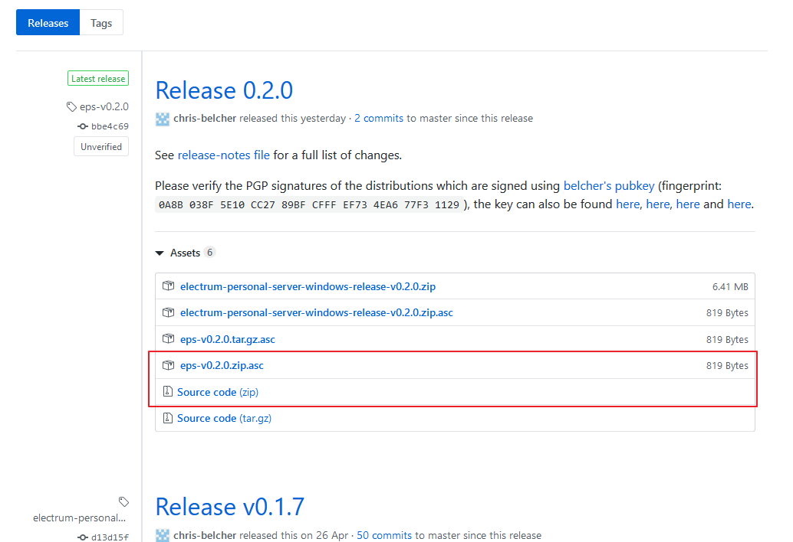
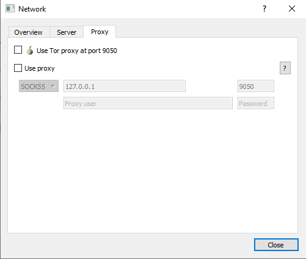
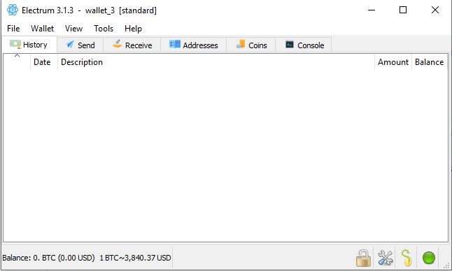
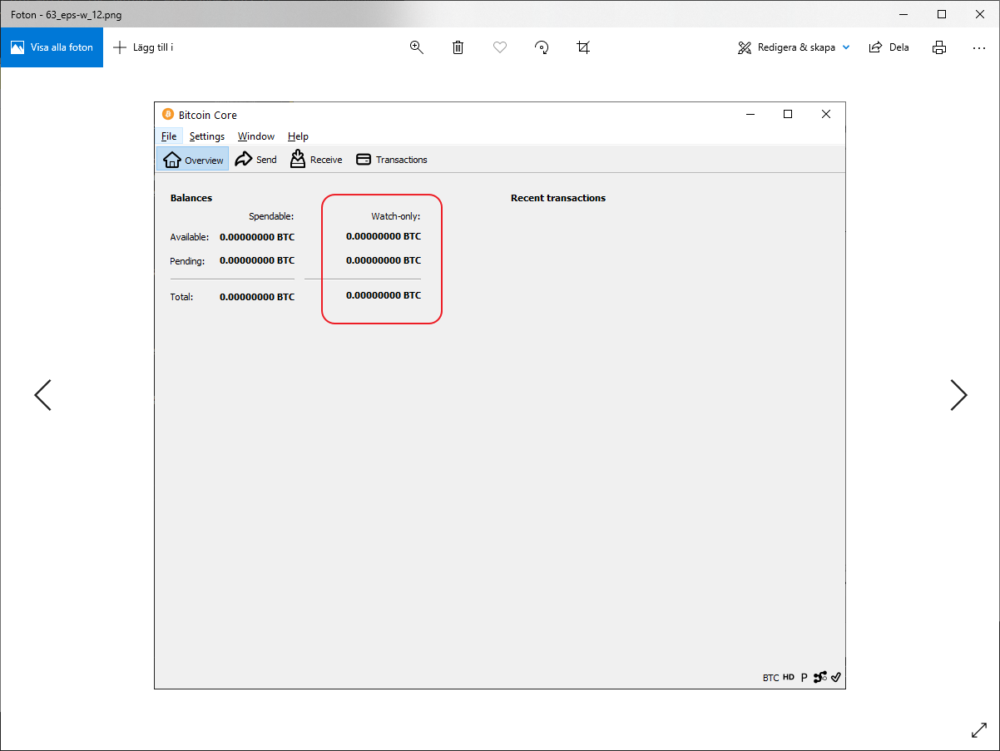

## Run Electrum Personal Server on Mac

*Difficulty: medium*
{: .no_toc }

## Table of contents
{: .no_toc .text-delta }

1. TOC
{:toc}

*Note: I am not normally a Mac user, any suggestions for improvements to the guide is appreciated.*

Electrum Personal Server will connect your Bitcoin full node to Electrum. This will make it possible to use all functionality in Electrum (Hardware Wallet support, easy multi-sig setup and more) while still validating and broadcasting everything with your full node.

Before starting, make sure you’ve got a Bitcoin Core full node running and up to sync. If don’t, see [Install and optimize Bitcoin Core](hodl-guide_61_bitcoin-core.md){:target="_blank"}.

You also need [Electrum](https://electrum.org/#download){:target="_blank"}. Always check the digital signatures before installing, more info on how [here](https://driftwoodpalace.github.io/Hodl-Guide/hodl-guide_40_multi-sig.html#download-and-verify-electrum){:target="_blank"}.

## Download the installation package

Go to [https://github.com/chris-belcher/electrum-personal-server](https://github.com/chris-belcher/electrum-personal-server){:target="_blank"} and read the intro (before How To) to know what this is and why it’s important.
Before installing anything we need to verify the downloads. To do this we need Chris Belchers signing-keys. It can be found [here](https://github.com/chris-belcher/electrum-personal-server/blob/master/docs/pubkeys/belcher.asc){:target="_blank"}.

On the page, click “raw”:


Use `Cmd+S` and save the key in a folder on your computer (do not change the file extension).

Then, navigate to the [release page](https://github.com/chris-belcher/electrum-personal-server/releases){:target="_blank"} and download the latest `Source code` (`electrum-personal-server-eps-v0.2.0.zip`) and the corresponding `.asc` file (needed to verify the downloaded file, in this example `eps-v0.2.0.zip.asc`). For example:



Place the files in the same folder that you saved the signing key in.

To verify the signature, we need Gpg Suite. If it’s not already installed, go to [https://gpgtools.org/](https://gpgtools.org/){:target="_blank"} and download and install the latest version. If you have issues with GPGTools, you could try another alternative from this list [https://www.gnupg.org/download/index.en.html#binary](https://gpgtools.org/){:target="_blank"}

We need to open a new terminal window. Click the Searchlight (magnifying glass) icon in the menu bar and type terminal. Select the Terminal application from the search results.

Change the working directory to the directory where the downloaded files are located. If you've placed the files in "downloads" type the following (everything after `$`) to the terminal:

`$ cd ~/downloads`

Then, import Belchers signing key to your local directory:

`> gpg --import belcher.asc`

We can now verify the download by typing (if you downloaded another version, change the file names):

`> gpg --verify eps-v0.2.0.zip.asc electrum-personal-server-eps-v0.2.0.zip`

The output should be something similar to this:

```
gpg: Signature made 12/05/19 10:50:36 W. Europe Standard Time
gpg:                using RSA key EF734EA677F31129
gpg: Good signature from "Chris Belcher <false@email.com>" [unknown]
gpg: WARNING: This key is not certified with a trusted signature!
gpg:          There is no indication that the signature belongs to the owner.
Primary key fingerprint: 0A8B 038F 5E10 CC27 89BF  CFFF EF73 4EA6 77F3 1129
```

We can see that the signature was made at a date close to the release, it's a `Good signature` and the Primary key fingerprint is the same as on Github. We can double check by doing a search online on the fingerprint. That confirms from various sources that the key seems to belong to Chris Belcher. If you got a different fingerprint or a bad signature, stop and investigate further.

If you want to move the folder out of downloads, do that now.

## Change the config-file

Open the folder electrum-personal-server-eps-v0.2.0 and make a copy of the file `config.ini_sample` and rename the copy to `config.ini`.

*Note:* Make sure that you can change the file extension from `.ini_sample` to `.ini`

Open `config.ini` with a text editor. If you are updating to a new version, simply copy the necessary information from an old config.ini-file to the new one (there's been some changes to the file, so only copy what's necessary).

#### For multi-sig wallets

To import a multi-sig wallet, open the wallet in Electrum. Go to `Wallet>Information` and copy the Master Public Key of cosigner 1. 

In the config.ini-file, create a new line and give the wallet a name. If you are using a 2 of 3 multi-sig, type `2` (required-signatures) after the name. Then paste cosigner 1s key. Go back to Electrum, copy the key for cosigner 2 and paste after cosigner 1s key (on the same row) and go back to Electrum and copy and paste the key for cosigner 3. Your row should look like this (but with your 3 keys):

```
my_multisig_wallet = 2 Zpub661MyMwA... Zpub6AMQ6ZPNa6... Zpub6A2po6ffdf...
```

You can change the name “my_multisig_wallet” if you like.

*Note:* This is storing your master public keys in cleartext on your computer. Anyone that gets hold of this information could derive all of your bitcoin addresses (your funds aren't at risk because of this but they'll be able to see your full balance).

#### Single wallet

If you want to add single wallet, for example with one key from a hardware wallet. Follow the same procedure. Open the wallet in Electrum and go to Wallet>Information and copy the Master Public Key. Pick a name and paste it to the config.ini file.
For example:

```
Hw_wallet1 = xpubkg4QUp5XpUdNf2uGXvQmnD4zcofZ1MN6Fo8PjqQ…
```

### Rest of the config.ini file

If you’ve moved your Bitcoin data directory (where your blocks and chainstate are stored) you need to add that directory to the line `datadir` (you might need to add this even if you use the default location, default locations can be found [here](https://en.bitcoin.it/wiki/Data_directory){:target="_blank"}. For example:

```
datadir = D:\Bitcoin
```

You can use the default RPC-verification for Bitcoin Core. In that case Bitcoin Core creates a cookie file for you and you don't have to add anything else to config.ini

Another alternative is to use `rpcauth` (username + hashed password) with Bitcoin Core. This can be necessary for applications like the lightning network to work. If you are using this you'll need to add that line to `config.ini` . 
```
rpcauth = <user>:some-hash-string
```

#### Change the bitcoin.conf file

We need to add the line `server=1` to our Bitcoin configuration file for Bitcoin Core to accepts connections from Electrum Personal Server. If you are unsure if you have a configuration file or not, open Bitcoin Core and go to `Settings>Options` and select `Open Configuration File` on the main tab. That should either create a new file in the right directory or open your existing file.

Add:

```
server= 1
```
to a new line (this'll turn on the RPC-server).

If you are using rpcauth, add this to a new line as well. If you are using EPS on another machine then your Bitcoin Core node (but in the same LAN), you might have to add `rpcallowip=<IP of PC with Electrum Personal Server>` and `rpcbind=<IP of Bitcoin Core node>` (thanks Jochen) too.
The file should in that case look like this:

```
server = 1
rpcallowip=<IP of PC with Electrum Personal Server>
rpcbind=<IP of Bitcoin Core node>
rpcauth = <user>:some-hash-string
```

The wallet in Bitcoin Core needs to be enabled. So, make sure that `disablewallet` is not present in the configuration file. Save and close the file. For the settings to have effect, you need to restart Bitcoin Core.

## Install with Python

### Updating to a new version

If you are updating from a previous version, you'll need to uninstall the previous version. Do this by typing `sudo pip3 uninstall electrum-personal-server` to the terminal. Then proceed according to the instructions below.

### Performing the installation

We need Python3 to install the server. Check if it’s installed for your user by going back to the terminal.
Type in :

`$ sudo python3 --version`

If Python 3 is installed, it should give an output with the version like `Python 3.7.2`. Otherwise go to [https://www.python.org/downloads/](https://www.python.org/downloads/){:target="_blank"} and download and install the latest version.

We are going to use `pip` to install the personal server. It should be installed with Python, but make sure you have the latest version by running this in the Terminal:

`$ sudo pip3 install --upgrade pip`

When it’s done, change the directory to the folder electrum-personal-server. If it's located in "Downloads" (make sure to change the name in the command if using a newer version):

`$ cd ~/downloads/electrum-personal-server-eps-v0.2.0`

Or if it's located in your home directory (all further examples will be with the folder located in the home directory):

`$ cd ~/electrum-personal-server-eps-v0.2.0`

Then use the command:

`$ sudo pip3 install --user .`

To install Electrum personal server.

### Troubleshooting 1

If you are getting errors, make sure you have the latest version of Python and Pip installed.

If you get a `DistutilsError` when installing the server you might not have all dependencies installed. Check the last line in the error message, it should look something like `Could not find suitable distribution for Requirement.parse('pytest-runner')`. If that's the case, you need to install `pytest-runner`.

Do this by going to the terminal and type the command:

`$ sudo pip3 install pytest-runner`

Then repeat the command:

`$ sudo pip3 install --user .`

## Starting the server

If everything was installed without errors, you should have two scripts; `electrum-personal-server` and `electrum-personal-server-rescan` in a Python folder on your computer. The default location for the scripts should be `~/Library/Python/3.7/bin`. Open a new finder window and navigate to the folder by pasting the path in `Go>Go To Folder` to make sure the scripts are created. If you used Python 3.6 change 3.7 to 3.6. If you want to navigate to the folder manually you might have to show hidden folders to find it.

We are going to create a simple script to automate the start of the server.

We need the path to the file `electrum-personal-server` and to the file `config.ini` that we modified in the unzipped folder earlier. We are going to place the script on the desktop, you can place it there for now and move it later if you like.

Create a new textfile and paste the paths to the file after each other. If you use python 3.7 and placed the unzipped file in your home directory, the line should be like this:

```
~/Library/Python/3.7/bin/electrum-personal-server ~/electrum-personal-server-eps-v0.2.0/config.ini
```

Before saving, go to settings and make sure `Plain Text` is selected and that the “If no extension is provided, use ‘.txt’ ” checkbox is unchecked on the save tab. Then save the file as `eps` with Unicode on your desktop.

In your terminal type:

`chmod 700 ~/desktop/eps`

That should make the file executable. Go back to your desktop and double click on the file. Electrum Server should now start and import addresses from the master public keys you defined in config.ini as watch only addresses in your Bitcoin Core node. Wait for the importing to finish.

### Troubleshooting 2

If you get an error message like this:

```
Traceback (most recent call last):
  File "/Users/me/Library/Python/3.7/bin/electrum-personal-server", line 5, in <module>
    from electrumpersonalserver.server.common import main
ModuleNotFoundError: No module named 'electrumpersonalserver'
```

It's probably your user that doesn't have permission to a specific folder. The folder should be `~/Library/Python/3.7/lib/python/site-packages/` (change `3.7` if using another version). Make sure your user can read and write to that folder ([How to change permissions](https://support.apple.com/guide/mac-help/change-permissions-for-files-folders-or-disks-mchlp1203/mac){:target="_blank"}). If that doesn't work make sure your user can read and write to the folder `~/Library/Python/3.7/bin/electrum-personal-server` as well.

If you get an error message like this:

```
WARNING:2019-02-27 09:32:22,102: Unable to find .cookie file, try setting `datadir` config
```

You might need to use `rpcauth` or change `datadir` to the correct path and make sure Bitcoin Core is running.

If you get an error with something like:

```
Error with bitcoin json-rpc
```

That means that the server can’t connect to your Bitcoin Core full node. This is likely an issue with one of your conf-files (either `config.ini` or `bitcoin.conf`). Below is a copy of a standard `config.ini`-file (all comments `#` in this file are removed for readability, can be a good idea to keep those)

```
[master-public-keys]
multisig_wallet = 2 xpub661MyMwAqRbcEYS8w7XLSVeEsBXy79zSzH1J8vCdxAZningWLdN3zgtU6LBpB85b3D2yc8sfvZU521AAwdZafEz7mnzBBsz4wKY5e4cp9LB xpub127pc4e5YKw4zsBBznm7zEfaZdwAA125UZvfs8cy2D3b58BpBL6Utgz3NdLWgninZAxdCv8J1HzSz97yXBsEeVSLX7w8SYEcbRqAwMyM9LB xpub7g5pc4e5YKwBL9MyMwAqRbcEYS8w7XLSVeEsBXy79zSzH1J8vCdxAZningWLdN3zgtU6LBpB85b3D2yc8sfvZU521AAwdZafEz7mnzBBsz4wKY5e4cp9LB
[watch-only-addresses]

[bitcoin-rpc]
host = 127.0.0.1
port = 8332
datadir = ~/Library/Application Support/Bitcoin/

wallet_filename =
poll_interval_listening = 30
poll_interval_connected = 5
initial_import_count = 1000
gap_limit = 25

[electrum-server]
host = 127.0.0.1
port = 50002
ip_whitelist = *
certfile = certs/cert.crt
keyfile = certs/cert.key
```

And what needs to be in `bitcoin.conf` (you can have other settings as well, this is what’s important for Electrum personal server):

```
server=1
```

You need to restart Bitcoin Core for changes in `bitcoin.conf` to have effect.

Another check you can do is to check so you don't have multiple bitcoin.conf files (in the default location and in the new location if you moved the installation). If you do. rename one of the files so it's not used by mistake (if you don't want to delete it).

You can also try to change the authentication method. If you use rpcuser and rpcpassword try the cookie method or the other way around.

## Start the server

Once the importing is done Electrum Personal Server will exit. If you use an old wallet that you want to import old transactions from, you need to rescan the Bitcoin blockchain. You can do this by running the following command in the terminal (make sure to change the paths if your files are located in other locations):

`~/Library/Python/3.7/bin/electrum-personal-server-rescan ~/electrum-personal-server-eps-v0.2.0/config.ini`

When asked, enter a date (in the format DD/MM/YYYY) from where you want to start importing addresses (the further back, the longer time it will take) and hit return. You will get a suggestion of a block height to start from. Enter `y` and hit return. Wait for the rescanning to finish (the server will exit once finished). If you don't do this and open an old wallet, the balance will show 0 (but will show the real balance if you rescan).

Once the rescanning is done, or if you only use new addresses. Run Electrum Personal Server from the "eps" script on your desktop again. This will start the server. Wait for this message:
```
Listening for Electrum Wallet ...
```

## Setting up Electrum
Now we only need to tell Electrum to listen to our server!

Start Electrum and open a wallet. If you don't have a wallet, you can create a "dummy-wallet" only to access the settings. Follow the steps [Here](https://driftwoodpalace.github.io/Hodl-Guide/hodl-guide_66_electrum-tor.html#setup-electrum){:target="_blank"} for creating a wallet (skip the settings part where we activate Tor)

When you have a wallet open, go to `Tools>Network`.

Uncheck Select server automatically and change `Server` to `localhost`:


If you use Electrum over Tor you have to disable this (no need to connect to your own server over Tor). Change tab to "Proxy" and uncheck "Use Tor":



Close the dialog once finished. Electrum is now be connected to your full node!

It's still a good idea to use Tor, but you'll have to do it with your Bitcoin Core node now. Check out the guide for [running Bitcoin Core over Tor](https://driftwoodpalace.github.io/Hodl-Guide/hodl-guide_61_bitcoin-core.html#running-bitcoin-core-over-tor){:target="_blank"}

### Disable connections to other servers

*Pro tip:* Create a script that starts Electrum and disables all connections to other servers. In that case you don’t risk connecting to a public server by mistake. Go to your desktop and make a copy of the script `eps`. Rename it `electrum-starter`. Right click on the file and open it with a text editor.

Change the content to (if you have Electrum installed in applications):

`open -a /applications/Electrum.app --args --oneserver --server localhost:50002:s`

Save and close the file.

You can now use this script to start Electrum and never have to worry about connecting to any remote server by mistake. You can close the script once Electrum has started.

Your wallet should be connected to your bitcoin full node (the circle in the bottom right corner should be green)!



You can verify that only your server is being used by going to `Tools>Network`. You should only see localhost at overview:


If you change tab to "Server". Localhost should be selected and everything should be greyed out (not possible to change anything).

If you now do a transaction, it should show up as "pending" in Electrum. You should see your balance in the column "Watch-only" and the transaction in "Recent transactions" in Bitcoin Core as well:



---

<< Back: [Bonus guides](hodl-guide_60_bonus.md) 
