## Recovery

*Difficulty: medium*
{: .no_toc }

## Table of contents
{: .no_toc .text-delta }

1. TOC
{:toc}

## Recovery options

This section is for someone who's trying to recover funds for someone else and who might be less technically comfortable then the person setting up the wallet. This section will give you a three different options to recover any funds.

You'll need the Electrum Wallet to access any funds, Go to [https://electrum.org/#download](https://electrum.org/#download){:target="_blank"} and download the installer for your operating system. Once downloaded, install and start the application.

I'm writing `Seed` below, the seed might be located in an `Envelope`. If that's the case, open the envelopes first.

### Option 1

If you can access `Seed A`, `Seed B`, the `USB-flash drive` used in this guide, the Coldcard hardware wallet and the Trezor hardware wallet (or the Ledger hardware wallet). Try the following:

Start Electrum, that should launch the "Install Wizard" (Otherwise go to `File > New/Restore`). Select `Choose...` and navigate to the the wallet-file on the `USB-flash drive`. Open it,  

That should open the wallet and prompt you for a password. Enter the `PW: ` written on `Seed A` and click Next:

That should open the wallet. You now have to connect two of the hardware wallets to the computer. Follow [Withdrawal Method 1](https://driftwoodpalace.github.io/Hodl-Guide/hodl-guide_40_multi-sig.html#withdrawal-method-1){:target="_blank"} and transfer the funds to a wallet you control (your wallet, at an exchange etc). You can connect the Coldcard to the computer instead of using a SD-card to transfer the transaction.

To unlock unlock the Coldcard use the `PIN` written on `Seed A`. On the Coldcard, the PIN consists of two parts. Use the first part of the PIN (should be marked on the note), click OK and then enter the second part. If you get any errors the "passphrase" might be incorrect. On the Coldcard, navigate to `Add Passphrase` on the first screen. Move past the warning and select `Edit Phrase`. Enter `PF-HW` that's written on `Seed B`.

To unlock the Trezor, first connect it to the computer. You should be asked to enter a PIN when you open the Electrum wallet. Enter the PIN written on `Seed B` (the numbers will be shuffled, you'll see them on the screen of the Trezor). Then you should be asked to enter a passphrase. Enter `PF-HW` that's written on `Seed B`.

If you are using a Ledger. Connect it to the computer, unlock it with the PIN written on `Seed C`. Then follow [this guide](https://support.ledger.com/hc/en-us/articles/115005214529-Advanced-passphrase-security){:target="_blank"} to enter the passhrase (`PF-HW` that's written on `Seed B`).

### Option 2

**!!!Warning!!!** The following method will include entering critical information that can be used to move any funds into a "hot computer" (computer connected to the internet). An malicious actor could steal funds during this process. This should be a one time thing and you should immediately move all funds you get access to. Move the funds to another wallet you control or an exchange etc. This should be the last recovery option, if possible, use "Option 1".

To use this method you'll need access to `Seed A`, `Seed B` and the `USB-flash drive` used to in this guide.

Start Electrum, that should launch the "Install Wizard" (Otherwise go to `File > New/Restore`). Insert the `USB-flash drive`. Select Choose, navigate to the USB and open the wallet-file located on it:

That should open the wallet and prompt you for a password. Enter the `PW: ` written on `Seed A` and click Next:

That should open the wallet (if you get any warnings about connecting hardware wallets, you can ignore and close them). In Electrum, go to `Wallet > Information`, select `Cosigner 3` and copy the `Zpub...`-key you see there. Paste this key somewhere (notepad or Word etc), we'll be using it later:

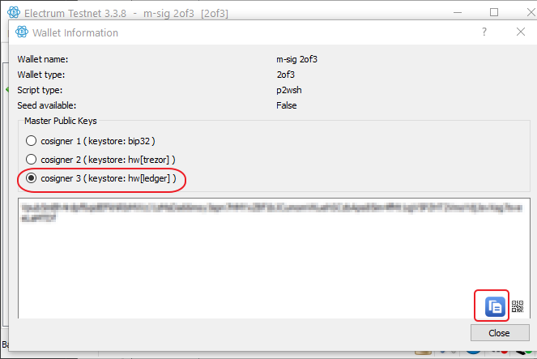

Then close the Wallet Information dialog, go to `File > New Restore`, that should bring up the Install wizard. We'll now restore the wallet. Give it a name if you like and click Next:

Select `Multi-signature wallet` and click Next:

Change the first slider to `3` so it looks like the picture below and click Next:

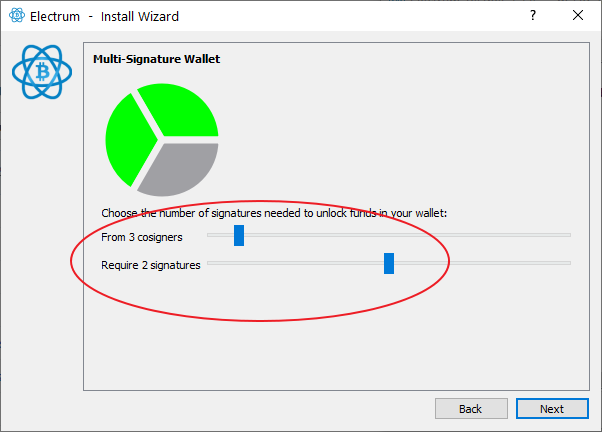

Select `I already have a seed` and click Next:

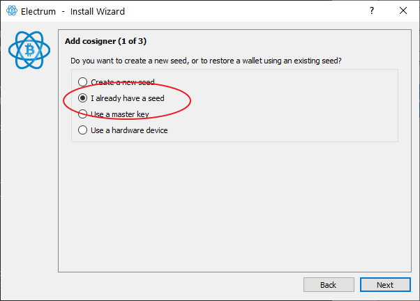

On the next screen, click on `Options`:

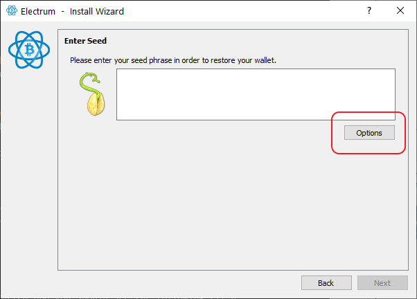

Check the box `BIP39 seed` and click OK:

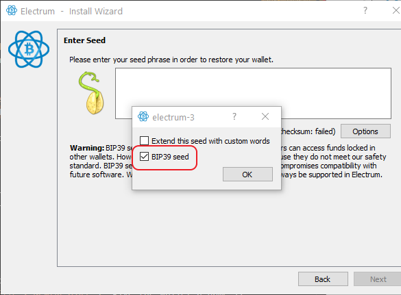

Now, in order, enter the 24 words written on `Seed A` and click Next:

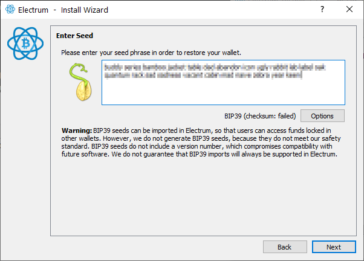

Make sure `native segwit multisig` is selected and click Next:

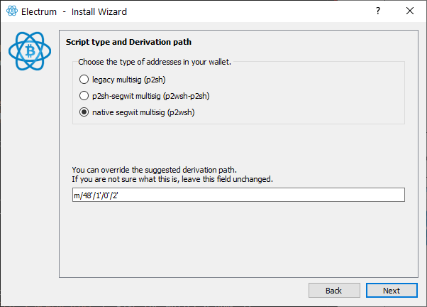

You can ignore the next screen and click Next:

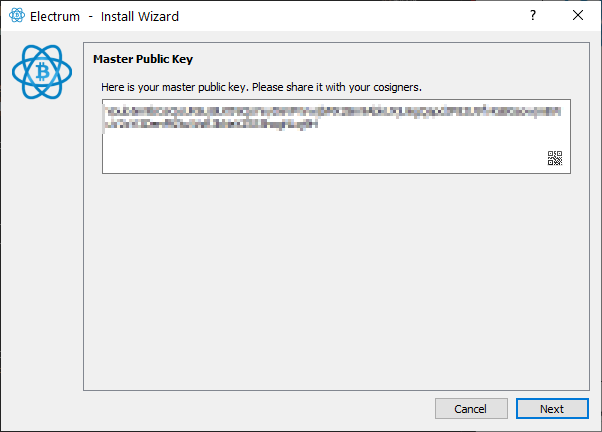

Then, select `Enter cosigner seed` and click Next:

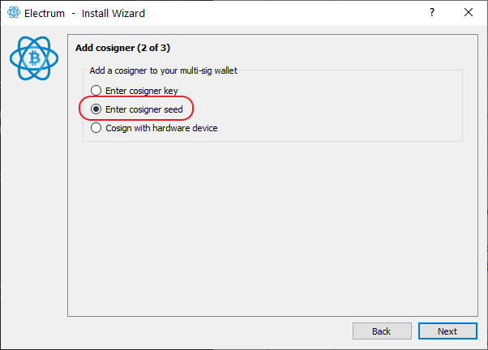

Repeat the same procedure as before, click on `Options`:

Check the box `BIP39 seed` and click OK:

Now, in order, enter the 24 words written on `Seed B` and click Next:

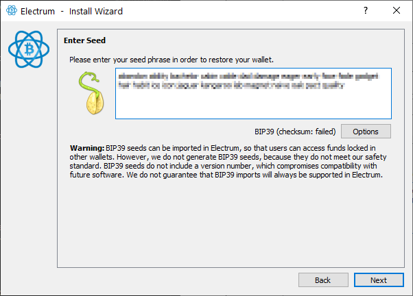

Make sure `native segwit multisig` is selected and click Next:

For the last key, select `Enter cosigner key` and click Next:

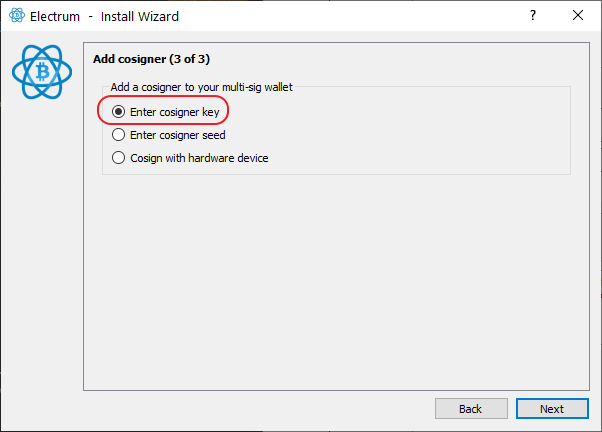

Paste the key you copied in the first step (Cosigner 3) and click Next:

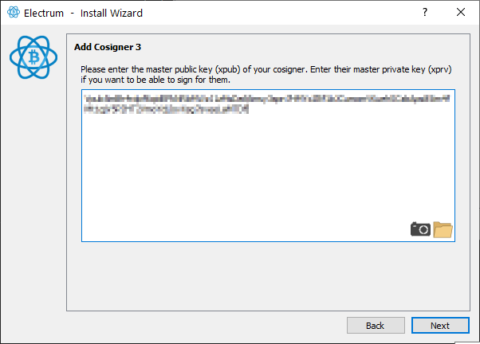

We don't need a password as we'll only use the wallet one time, click Next:

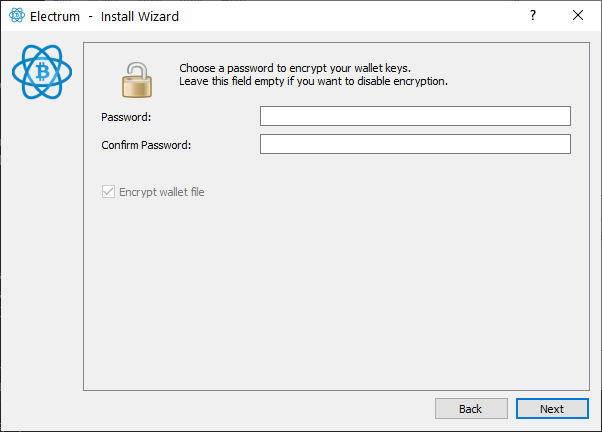

The wallet should now be recovered! Go to the `Send` tab. Enter the bitcoin address you'd like to send the funds to. Triple check so the address is correct, click `Max` and then `send`.

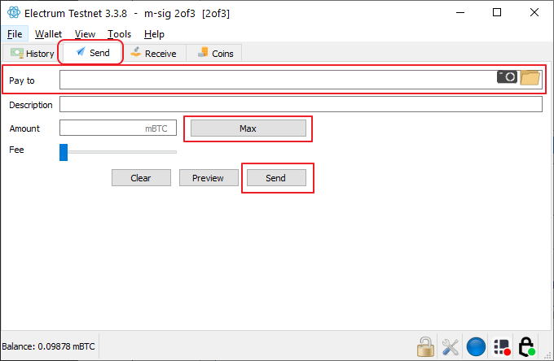

### Option 3

**!!!Warning!!!** The following method will include entering critical information that can be used to move any funds into a "hot computer" (computer connected to the internet). An malicious actor could steal funds during this process. This should be a one time thing and you should immediately move all funds you get access to. Move the funds to another wallet you control or an exchange etc. This should be the last recovery option, if possible, use "Option 1".

To use this method you'll need access to `Seed A`, `Seed B` and `Seed C`. 

Start Electrum, that should launch the "Install Wizard" (Otherwise go to `File > New/Restore`)

We'll now restore the wallet. Give it a name if you like and click Next:

Select `Multi-signature wallet` and click Next:

Change the first slider to `3` so it looks like the picture below and click Next:

Select `I already have a seed` and click Next:

On the next screen, click on `Options`:

Check the box `BIP39 seed` and click OK:

Now, in order, enter the 24 words written on `Seed A` and click Next:

Make sure `native segwit multisig` is selected and click Next:

You can ignore the next screen and click Next:

Then, select `Enter cosigner seed` and click Next:

Repeat the same procedure as before, click on `Options`:

Check the box `BIP39 seed` and click OK:

Now, in order, enter the 24 words written on `Seed B` and click Next:

Make sure `native segwit multisig` is selected and click Next:

For the last key, select `Enter cosigner seed` and click Next:

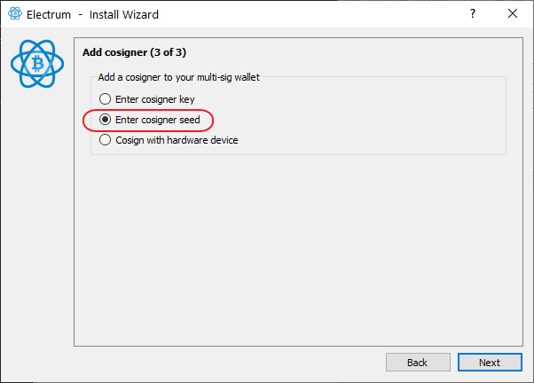

Repeat the same procedure as before, click on `Options`:

Check the box `BIP39 seed` and click OK:

Now, in order, enter the 24 words written on `Seed C` and click Next:

Make sure `native segwit multisig` is selected and click Next:

We don't need a password as we'll only use the wallet one time, click Next:

The wallet should now be recovered! Go to the `Send` tab. Enter the bitcoin address you'd like to send the funds to. Triple check so the address is correct, click `Max` and then `send`.

---

<< Back: [Bonus guides](hodl-guide_60_bonus.md) 